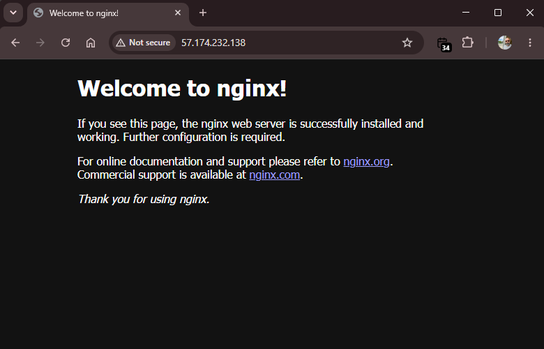
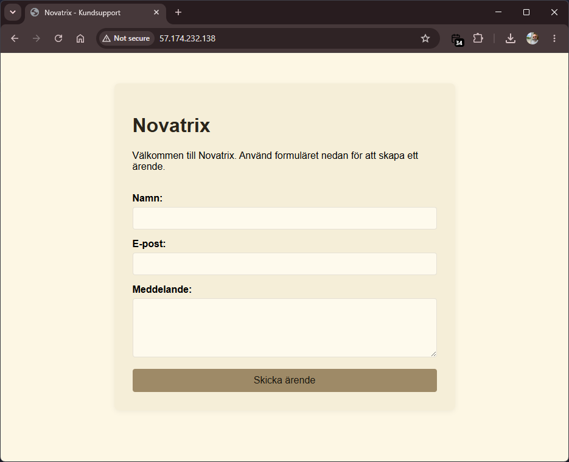

# v34 — Compute och kom igång

**Daniel Assarélius** · MOV25 · Microsoft Azure · Novatrix AB

Repo: [github.com/82danass/azure](https://github.com/82danass/azure) · Vecka: [v34](https://github.com/82danass/azure/tree/master/v34)

- [x] Sätt upp kursrepo på GitHub (README med namn, kurs, veckorubrik)
- [x] Provisionera Ubuntu-VM
- [x] Installera Nginx
- [x] Driftsätt kundtjänstsidan med ärendeformulär
- [x] Verifiera och dokumentera

## Verifiering

Ansluter till servern via SSH:

`ssh -i D:\MOV25\GitHub\azure\keys\vm-novatrix-web-key.pem azureuser-web@57.174.232.138`

```shell
Welcome to Ubuntu 24.04.4 LTS (GNU/Linux 6.17.0-1022-azure x86_64)

 * Documentation:  https://help.ubuntu.com
 * Management:     https://landscape.canonical.com
 * Support:        https://ubuntu.com/pro

 System information as of Thu Aug 20 15:43:05 UTC 2026

  System load:  0.0               Processes:             123
  Usage of /:   6.6% of 28.02GB   Users logged in:       0
  Memory usage: 36%               IPv4 address for eth0: 172.16.0.4
  Swap usage:   0%

Last login: Thu Aug 20 15:40:29 2026 from 80.217.168.6
```

Kontrollerar att Nginx lyssnar på port 80:

`sudo ss -tulpn | grep :80`

```shell
tcp   LISTEN 0      511            0.0.0.0:80        0.0.0.0:*    users:(("nginx",pid=7566,fd=5),("nginx",pid=7565,fd=5),("nginx",pid=7564,fd=5))
tcp   LISTEN 0      511               [::]:80           [::]:*    users:(("nginx",pid=7566,fd=6),("nginx",pid=7565,fd=6),("nginx",pid=7564,fd=6))
```

Visar vilken process som äger porten:

`sudo lsof -i :80`

```shell
COMMAND  PID     USER   FD   TYPE DEVICE SIZE/OFF NODE NAME
nginx   7564     root    5u  IPv4  29698      0t0  TCP *:http (LISTEN)
nginx   7564     root    6u  IPv6  29699      0t0  TCP *:http (LISTEN)
nginx   7565 www-data    5u  IPv4  29698      0t0  TCP *:http (LISTEN)
nginx   7565 www-data    6u  IPv6  29699      0t0  TCP *:http (LISTEN)
nginx   7566 www-data    5u  IPv4  29698      0t0  TCP *:http (LISTEN)
nginx   7566 www-data    6u  IPv6  29699      0t0  TCP *:http (LISTEN)
```

Verifierar att webbservern svarar lokalt:

`curl -I http://127.0.0.1`

```shell
HTTP/1.1 200 OK
Server: nginx/1.24.0 (Ubuntu)
Date: Thu, 20 Aug 2026 15:43:29 GMT
Content-Type: text/html
Content-Length: 615
Last-Modified: Thu, 20 Aug 2026 15:33:04 GMT
Connection: keep-alive
ETag: "6a871e30-267"
Accept-Ranges: bytes
```



Verifierar att porten är nåbar:

`nc -zv 127.0.0.1 80`

```shell
Connection to 127.0.0.1 80 port [tcp/http] succeeded!
```

Kopierar kundtjänstsidan (HTML/CSS) till servern och flyttar den till webbroten:

`scp -i D:\MOV25\GitHub\azure\keys\vm-novatrix-web-key.pem -r D:\MOV25\GitHub\azure\v34\public\* azureuser-web@57.174.232.138:~/ ; ssh -i D:\MOV25\GitHub\azure\keys\vm-novatrix-web-key.pem azureuser-web@57.174.232.138 "sudo mv ~/index.html ~/style.css /var/www/html/"`

```shell
index.html   100% 1091    34.4KB/s   00:00
style.css    100% 1319    39.0KB/s   00:00
```


