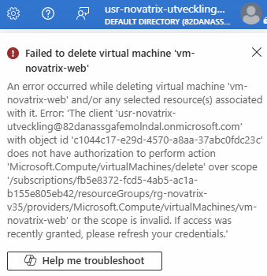
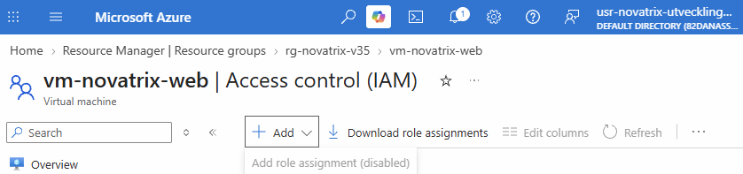

# v35 — IAM och identitet

**Daniel Assarélius** · MOV25 · Microsoft Azure · Novatrix AB

Repo: [github.com/82danass/azure](https://github.com/82danass/azure) · Vecka: [v35](https://github.com/82danass/azure/tree/master/v35)

- [x] Uppdatera README för v35
- [x] Skapa identiteter/grupper i Entra ID
- [x] Tilldela RBAC-roller (least privilege)
- [x] Förbered managed identity för appen
- [x] Verifiera och dokumentera

## Rollmodell

Novatrix har fått två roller och två fiktiva användare (med faktiska konton och anknytningar) den här veckan. Behörigheter sätts på grupper, aldrig på personer, och alla tilldelningar görs på resursgruppen `rg-novatrix-v35`, inte på prenumerationen.

| Grupp | Medlem | Roll | Scope | Varför |
| --- | --- | --- | --- | --- |
| `grp-novatrix-drift` (SysOp) | `usr-novatrix-drift` | Virtual Machine Contributor | `rg-novatrix-v35` | 'Drift' kan starta, stoppa, ändra storlek på och bygga om servern. Rollen stannar under Contributor, så drift kan inte ändra nätverket eller dela ut roller. |
| `grp-novatrix-utveckling` (DevOp) | `usr-novatrix-utveckling` | Reader | `rg-novatrix-v35` | Utvecklarna behöver se miljön för att felsöka applikationen. Ändringar går via pipeline, aldrig för hand, så läsrätt räcker. |
| `id-novatrix-app` (managed identity) | — | ingen | — | Appens identitet. Får ingen behörighet i v35. |

Jag valde inbyggda roller framför egna: de är dokumenterade, granskade och kända för den som läser IAM-bladet efter mig. Contributor på resursgruppen hade räckt för drift men ger också `Microsoft.Network/*` och `Microsoft.Authorization/roleAssignments/write`, och det är precis det drift inte ska ha. Virtual Machine Contributor är den minsta inbyggda rollen som täcker det drift faktiskt gör (borde få göra).
Ingen människa får Owner. Owner ligger kvar på mitt eget konto på prenumerationen, och det är det enda stället. Modellen alltså Account Owner knuten till en person har alltid sina brister dock men det är vad det är.

## Identiteter

Grupper och användare skapas i Entra ID av `mov`, med namn från [`naming.json`](../mov-workspace/naming.json): `grp-{företag}-{syfte}` och `usr-{företag}-{syfte}`.

`mov directory show`

```shell
 kind  ┃ purpose    ┃ name                                                        ┃ created for
━━━━━━━╇━━━━━━━━━━━━╇━━━━━━━━━━━━━━━━━━━━━━━━━━━━━━━━━━━━━━━━━━━━━━━━━━━━━━━━━━━━━╇━━━━━━━━━━━━━
 group │ drift      │ grp-novatrix-drift                                          │ v35
 group │ utveckling │ grp-novatrix-utveckling                                     │ v35
 user  │ drift      │ usr-novatrix-drift@82danassgafemolndal.onmicrosoft.com      │ v35
 user  │ utveckling │ usr-novatrix-utveckling@82danassgafemolndal.onmicrosoft.com │ v35
```

Varje användare skapas med ett genererat lösenord på 24 tecken och tvingas byta det vid första inloggningen. Startlösenordet skrivs till en gitignorerad fil i workspacet och är förbrukat efter första inloggningen. Tenanten har Entra security defaults påslaget, så MFA krävs för varje ny användare direkt, det är inget jag valt bort och inget jag tycker man ska slentrianmässigt välja bort.

Katalogobjekten ligger i tenanten och inte i resursgruppen. `mov down v35` river resursgruppen men lämnar grupper och användare kvar, med flit (än så länge).

## Managed identity

`id-novatrix-app` är en user-assigned managed identity i `rg-novatrix-v35`. Den har ingen roll någonstans. Poängen är att appen i v37 ska nå lagringen med den här identiteten i stället för en nyckel eller ett lösenord i koden. Att den finns redan nu, utan behörighet, betyder att v37 bara behöver lägga till en rad under `rbac.assignments`.

Så här ser tilldelningarna på gruppen ut, läst tillbaka från Azure. Identiteten syns inte, för den har inget:

`mov audit --section resourceGroupRoles`

```shell
Who can change the group — rg-novatrix-v35
Role                        ┃ Principal           ┃ Type  ┃ Inherited from
━━━━━━━━━━━━━━━━━━━━━━━━━━━━╇━━━━━━━━━━━━━━━━━━━━━╇━━━━━━━╇━━━━━━━━━━━━━━━━━━━━━━━━━━━━━━━━━━━━━━━━━━━━━━━━━━━━━━━━━━━━━━━━━━━━━━━━━━━━
Reader                      │ Novatrix Utveckling │ Group │ /subscriptions/…/resourcegroups/rg-novatrix-v35
Virtual Machine Contributor │ Novatrix Drift      │ Group │ /subscriptions/…/resourcegroups/rg-novatrix-v35
```

## Verifiering

Inloggad i portalen som `usr-novatrix-utveckling` (Reader). Resursgruppen och servern syns, det ska de. Försök att ta bort servern:



Felet säger exakt vad som saknas: `Microsoft.Compute/virtualMachines/delete` på scope `rg-novatrix-v35`. Samma användare kan inte heller dela ut roller, knappen är avstängd:



Att verifiera från terminalen som testanvändaren gick inte: `az login` med device code stoppas av security defaults för ett konto som just fått MFA påtvingat. Portalen visar samma sak med tydligare fel, så det är portalen som är beviset.

Hur man verifierar att en roll är begränsad, generellt: logga in som en medlem i gruppen, gör det rollen ska tillåta och kontrollera att det går, gör sedan något som ligger precis utanför rollen och kontrollera att det nekas med `AuthorizationFailed`. Felmeddelandet namnger alltid den action som saknas, så man ser att det är rätt gräns som stoppar och inte något annat.

## Hur modellen skalar

En roll är en grupp plus en rad i profilen. Ett nytt team, säg support, blir:

```json
{ "purpose": "support", "displayName": "Novatrix Support", "description": "..." }
```

under `directory.groups`, och

```json
{ "role": "Reader", "principal": { "kind": "group", "purpose": "support" }, "scope": "resourceGroup", "justification": "..." }
```

under `rbac.assignments`. `mov up v35` skapar gruppen och tilldelningen, `mov plan v35` visar innan att det är det enda som ändras. En ny person i ett befintligt team är ett gruppmedlemskap i Entra, inga roller rörs.

`justification` är obligatoriskt i profilen och skrivs in som beskrivning på själva rolltilldelningen, så motiveringen följer med till portalen och syns för den som granskar IAM-bladet. Tilldelningarnas namn genereras deterministiskt från scope, principal och roll, så en omkörning verifierar mot tillståndet i stället för att skapa dubbletter.

När miljön får fler resurser snävas scope in: v37 ger `id-novatrix-app` rätt på en enda storage-container, inte på gruppen. Profilen stödjer `"scope": "storageAccount"` för det. Regeln är att ingen tilldelning ska vara bredare än den resurs rollen faktiskt används mot.

## Automatisering

Allt ovan byggs från en profil med [mov](https://github.com/Arelius-D/mov), samma harness som i v34. Profilen ärver v34 och lägger till det som är nytt: katalogobjekt, identitet och rolltilldelningar.

### Profil

[`mov-workspace/profiles/v35.json`](../mov-workspace/profiles/v35.json)

```json
{
  "env": "v35",
  "extends": "v34",
  "description": "IAM: Entra ID roles for Novatrix, least-privilege RBAC on the resource group, and a managed identity prepared for the storage env.",

  "stages": ["preflight", "rg", "network", "cost", "directory", "identity", "rbac", "compute", "verify"],

  "network": {
    "addressSpace": "10.35.0.0/16",
    "subnets": [
      { "purpose": "web", "prefix": "10.35.1.0/24", "nsg": "web" }
    ]
  },

  "directory": {
    "domain": "82danassgafemolndal.onmicrosoft.com",
    "groups": [
      { "purpose": "drift", "displayName": "Novatrix Drift", "description": "Operations: runs and repairs the environment." },
      { "purpose": "utveckling", "displayName": "Novatrix Utveckling", "description": "Developers: read the environment, deploy through the pipeline." }
    ],
    "users": [
      { "purpose": "drift", "displayName": "Novatrix Driftstekniker", "groups": ["drift"] },
      { "purpose": "utveckling", "displayName": "Novatrix Utvecklare", "groups": ["utveckling"] }
    ]
  },

  "identity": {
    "userAssigned": [
      { "purpose": "app", "description": "The errand form's identity. Deliberately given no permissions this env -- v37 grants it write access to exactly one blob container." }
    ]
  },

  "rbac": {
    "assignments": [
      {
        "role": "Virtual Machine Contributor",
        "principal": { "kind": "group", "purpose": "drift" },
        "scope": "resourceGroup",
        "justification": "Operations must start, stop, resize and rebuild the VM. It stops short of Contributor, so they cannot alter the network or hand out roles."
      },
      {
        "role": "Reader",
        "principal": { "kind": "group", "purpose": "utveckling" },
        "scope": "resourceGroup",
        "justification": "Developers need to see the environment to diagnose the application. They change it through the pipeline, never by hand, so read is all they need."
      }
    ]
  }
}
```

Rollerna står med portalens namn. Definitions-id slås upp vid deploy, och principal-id kommer från vad `directory`- och `identity`-stegen skapade, så profilen innehåller inga GUID:n.

### Bygga

`mov up v35`

```shell
up v35 -> rg-novatrix-v35 in swedencentral

1/9 preflight Verify tooling, identity and providers
     OK   signed in as: 82danass@gafe.molndal.se
     OK   subscription: MOV25 - Azure subscription (Enabled)
     OK   vm size Standard_B2ts_v2: available in swedencentral
     WARN admin exposure: web/ssh allow SSH from anywhere -- set admin.sshSource to your own address
2/9 rg Create the resource group
     resource group rg-novatrix-v35 created in swedencentral
3/9 network Virtual network, subnets and NSGs
     mov-v35-network-cda4f2b1
4/9 cost Budget and spend alerts
     mov-v35-cost-99d6dcdf
5/9 directory Entra ID users and groups (tenant scope)
     OK   created group Novatrix Drift (grp-novatrix-drift)
     OK   created group Novatrix Utveckling (grp-novatrix-utveckling)
     OK   created user usr-novatrix-drift@82danassgafemolndal.onmicrosoft.com
     OK   created user usr-novatrix-utveckling@82danassgafemolndal.onmicrosoft.com
     OK   added usr-novatrix-drift@82danassgafemolndal.onmicrosoft.com to grp-novatrix-drift
     OK   added usr-novatrix-utveckling@82danassgafemolndal.onmicrosoft.com to grp-novatrix-utveckling
6/9 identity User-assigned managed identities
     mov-v35-identity-b0537912
7/9 rbac Role assignments
     mov-v35-rbac-525cea1a
8/9 compute Public IP, NIC and the VM
     OK   generated SSH key D:\MOV25\GitHub\azure\mov-workspace\keys\mov-v35
     mov-v35-compute-web-f0b8eaa5
9/9 verify Prove the deployment answers
     OK   web: http://4.223.105.20/ -> 200 in 50s
     OK   web cloud-init: status: done
     OK   web bootstrap: present
     OK   web nginx: active
```

Steg 5 är Graph-anrop (`az ad ...`) eftersom katalogen inte är ARM. Steg 6 och 7 är vanliga ARM-deployer, mallarna ligger i [`arm/`](arm/): [`identity.template.json`](arm/identity.template.json) skapar identiteten, [`rbac.template.json`](arm/rbac.template.json) tilldelningarna, och [`rbac.parameters.json`](arm/rbac.parameters.json) är exakt de parametrar Azure fick, motiveringarna inklusive.

### Återskapa

Miljön rivs när dagen är slut och byggs upp igen nästa gång, så att krediten bara går till det som används. Det är ett kommando åt varje håll.

`mov down v35`

```shell
About to delete rg-novatrix-v35 and its 7 resource(s):
  Microsoft.Network/networkSecurityGroups  nsg-novatrix-web
  Microsoft.Network/virtualNetworks  vnet-novatrix
  Microsoft.ManagedIdentity/userAssignedIdentities  id-novatrix-app
  Microsoft.Network/publicIPAddresses  pip-novatrix-web
  Microsoft.Network/networkInterfaces  nic-novatrix-web
  Microsoft.Compute/virtualMachines  vm-novatrix-web
  Microsoft.Compute/disks  vm-novatrix-web_OsDisk_1_51316489a12d460da0977ea03f0c742d
  Microsoft.Consumption/budgets  budget-novatrix-v35
Delete rg-novatrix-v35? [y/N]: y
OK   deleted budget budget-novatrix-v35
OK   removed ssh entry v35-web
OK   removed key mov-v35
OK   removed key mov-v35.pub
OK   deleting rg-novatrix-v35 (running in the background)
```

Resursgruppen, identiteten, rolltilldelningarna, budgeten och SSH-nyckeln försvinner. Grupperna och användarna i Entra ID gör det inte, de ligger i tenanten och rivs bara med `mov directory down`.

`mov up v35` bygger sedan upp exakt samma miljö igen, med samma namn, samma roller på samma grupper och samma motiveringar i tilldelningarna. `directory`-steget hittar grupperna och användarna och går vidare, `rbac`-steget tilldelar mot samma gruppobjekt. `mov rebuild v35` gör båda i ett svep.

### Dokumentation

```powershell
mov docs v35                # varje kommando som kördes, med svar
mov templates export v35    # mallarna och parametrarna Azure fick
mov audit -f md -o audit.md # tenanten läst tillbaka
```

`mov docs` skrev 30 kommandon och `mov audit` läste hela tenanten. Ingen av de utskrifterna ligger i repot: transkriptet innehåller startlösenorden, auditen fakturerings- och kontouppgifter. Utdraget under *Managed identity* ovan är den del av auditen som hör till uppgiften. [`arm/`](arm/) ligger i repot, det är mallarna och parametrarna Azure fick.
