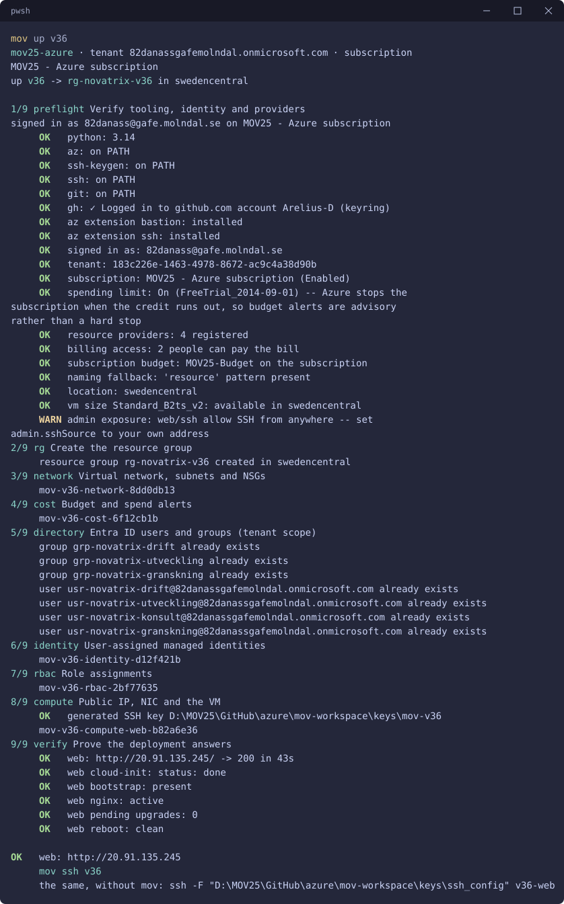
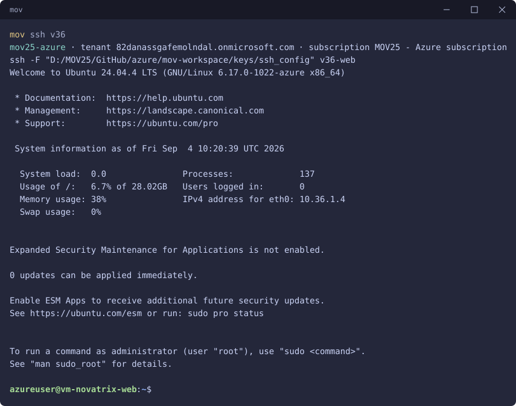
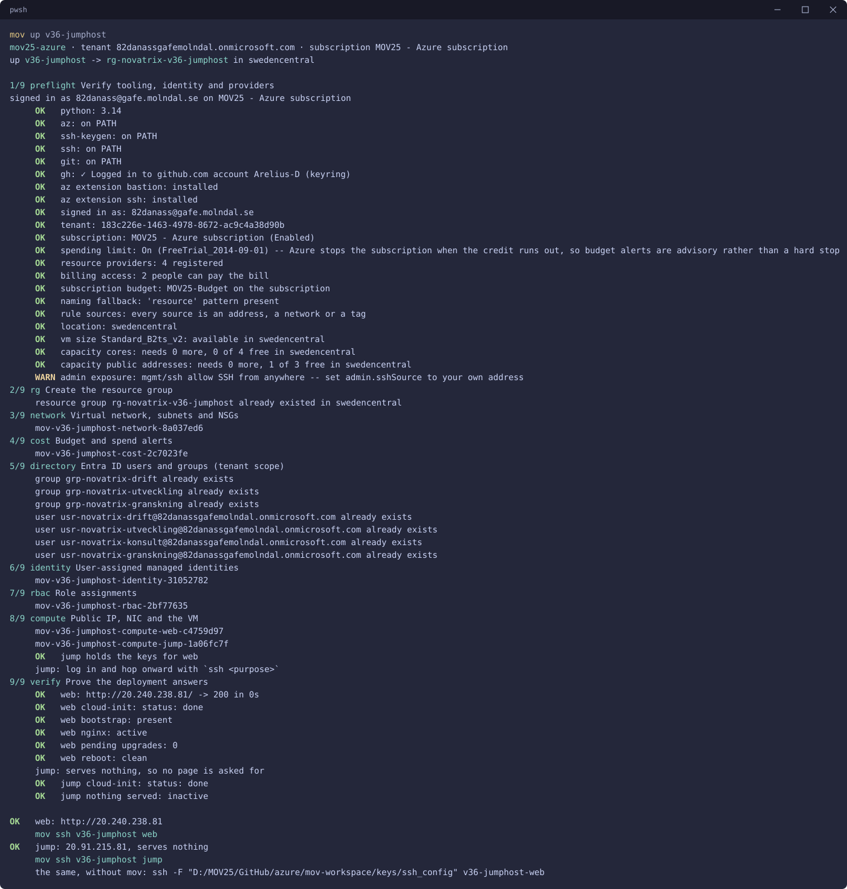
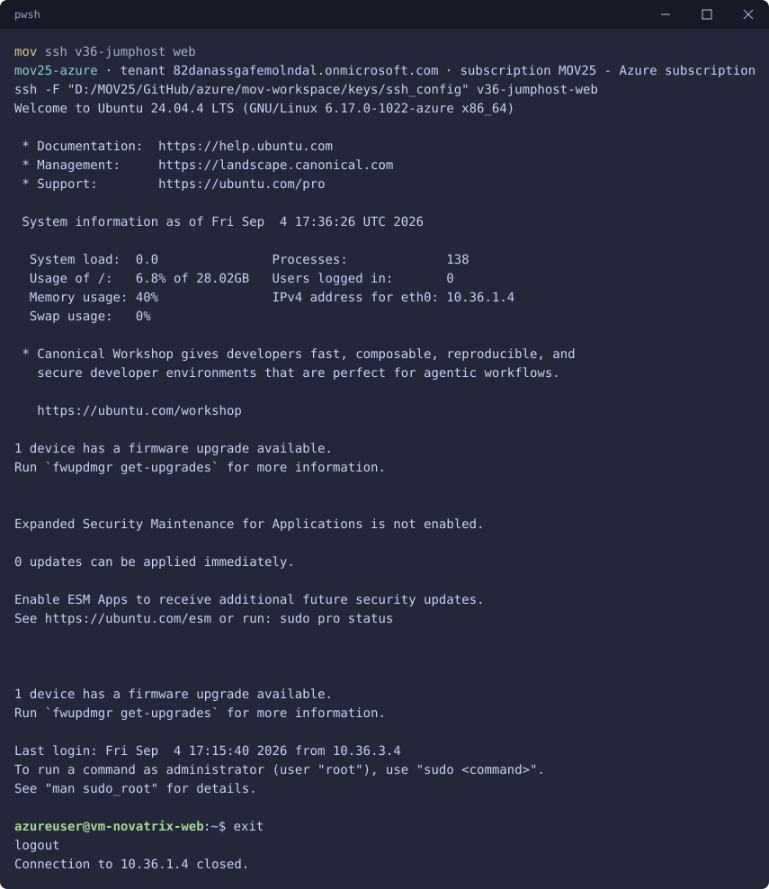
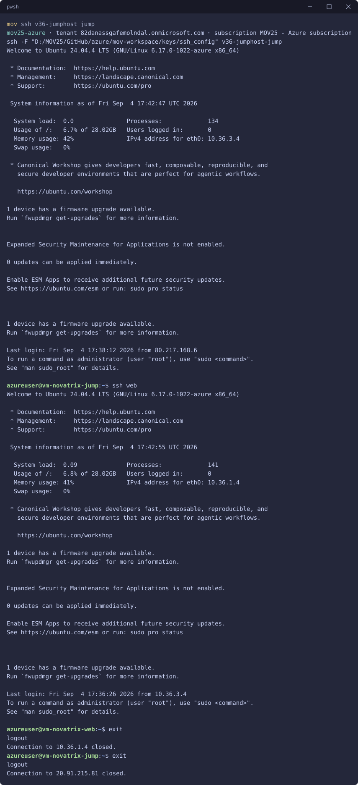
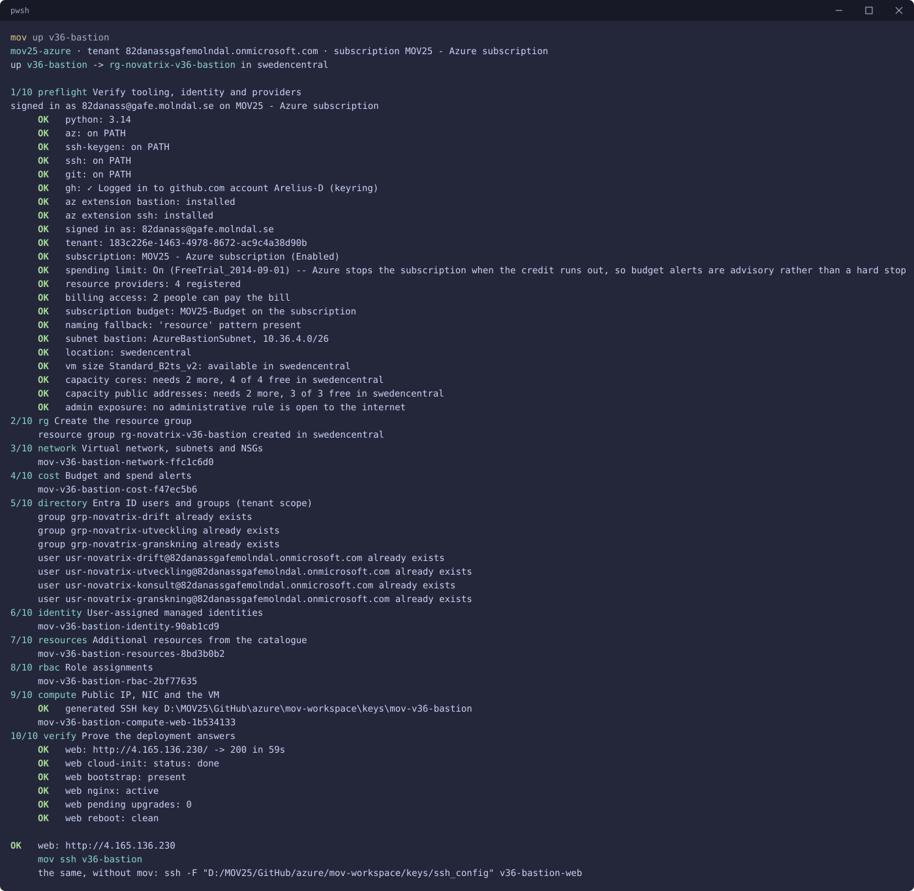
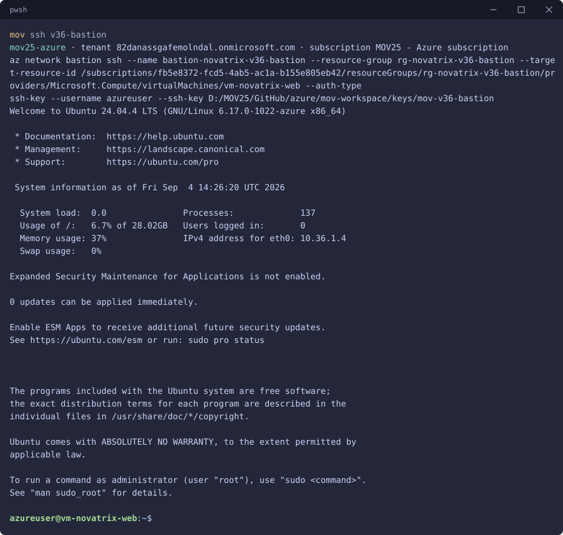

# v36 — Nätverk och säkerhet

**Daniel Assarélius** · MOV25 · Microsoft Azure · Novatrix AB

Repo: [github.com/82danass/azure](https://github.com/82danass/azure) · Vecka: [v36](https://github.com/82danass/azure/tree/master/v36)

- [x] Uppdatera README för v36
- [x] Bygg VNet med publikt/privat subnät
- [x] Säkra trafiken med NSG:er
- [x] Placera lösningen i nätverket
- [x] Verifiera och dokumentera

## Nätverket

Ärendeformuläret v34-35 nu med ett riktigt nätverk. Ett VNet, `vnet-novatrix`, med adressrymden `10.36.0.0/16`, och tjänsterna delade i skikt i stället för att ligga på samma yta:

| Subnät | Prefix | NSG | Publikt | Vad som ligger där |
| --- | --- | --- | --- | --- |
| `snet-novatrix-web` | `10.36.1.0/24` | `nsg-novatrix-web` | ja | `vm-novatrix-web`, Nginx och formuläret |
| `snet-novatrix-data` | `10.36.2.0/24` | `nsg-novatrix-data` | nej | tomt i v36, hit flyttar lagringen i v37 |

Webbskiktet är publikt för att det ska vara det: kunder ska nå formuläret. Dataskiktet är märkt `private` i profilen, har inga publika adresser och tar inte emot något från internet. Att subnätet finns redan nu, tomt, är avsiktligt. v37 ska bara behöva lägga till lagringen, inte rita om nätverket.

Adressrymden är densamma i alla tre miljöerna nedan. De ligger i var sin resursgrupp, i var sitt VNet, utan peering, så överlappet spelar ingen roll.

## Regler

`nsg-novatrix-web`

| Prio | Regel | Port | Källa | Effekt |
| --- | --- | --- | --- | --- |
| 100 | `http` | TCP 80 | valfri | Tillåt |
| 110 | `https` | TCP 443 | valfri | Tillåt |
| 120 | `ssh` | TCP 22 | `admin.sshSource` | Tillåt |
| 4000 | `deny-all-inbound` | alla | valfri | Neka |

`nsg-novatrix-data`

| Prio | Regel | Port | Källa | Effekt |
| --- | --- | --- | --- | --- |
| 100 | `allow-web-subnet` | alla | `10.36.1.0/24` | Tillåt |
| 4000 | `deny-internet-inbound` | alla | `Internet` | Neka |

Två saker är värda att stanna vid. Den explicita nekaregeln på 4000 är inte dekoration: Azures inbyggda regler släpper in all trafik inifrån VNet:et på 65000 (`AllowVnetInBound`), och en egen `Deny` på 4000 ligger före den. Utan den regeln är två subnät i samma VNet öppna mot varandra. Och `admin.sshSource` är en parameter, inte ett värde i profilen. Port 22 sätts vid deploy, inte i koden.

Dataskiktet får bara ta emot från webbskiktet. Det är poängen med att dela upp: att en komprometterad webbserver ska vara en komprometterad webbserver och inget mer.

## Administrativ åtkomst

Uppgiften stannar vid ett VNet med NSG:er, men den intressanta frågan i veckan är hur *jag* kommer in på servern, inte hur kunden når formuläret. Jag byggde tre miljöer och lät dem stå bredvid varandra, för det är där skillnaden syns.

### v36

Enklaste varianten. Dörren in sitter på webbservern själv, samma maskin som kör Nginx.

`mov up v36`



Preflight säger vad som är fel innan något byggs:

```shell
     WARN admin exposure: web/ssh allow SSH from anywhere -- set
admin.sshSource to your own address
```

Körningen ovan är gjord med `admin.sshSource` kvar på `*`, alltså port 22 öppen mot hela internet. Samma svaghet som i v34, fast nu med en varning som pekar på den. Källan står i `admin.sshSource` i [`defaults.json`](../mov-workspace/defaults.json) och gäller alla miljöer som inte skriver över den. Skillnaden mellan "öppen mot världen" och "öppen mot mig" är alltså ett värde, och regeln den styr sitter på fel ställe: på maskinen som också är publik.

`mov ssh v36`



Servern svarar på `10.36.1.4`, alltså inifrån webbsubnätet, och formuläret på `http://20.91.135.245`.

### v36-jumphost

Samma nätverk plus ett tredje subnät och en maskin som inte serverar något.

| Subnät | Prefix | NSG | Regel |
| --- | --- | --- | --- |
| `snet-novatrix-mgmt` | `10.36.3.0/24` | `nsg-novatrix-mgmt` | 22 från `admin.sshSource`, allt annat nekas |
| `snet-novatrix-web` | `10.36.1.0/24` | `nsg-novatrix-web` | 22 **endast** från `10.36.3.0/24` |

Webbservern kan inte längre öppnas från internet över SSH, oavsett vad `admin.sshSource` står på. Hoppmaskinen är enda vägen, och den kör ingenting utom `openssh-client`, inget Nginx och ingen webbplats. Verifieringen slår fast just det:

```shell
     jump: serves nothing, so no page is asked for
     OK   jump cloud-init: status: done
     OK   jump nothing served: inactive
```

`mov up v36-jumphost`



Hoppmaskinen bär nyckeln till webbservern, och `compute`-steget säger det rakt ut:

```shell
     OK   jump holds the keys for web
     jump: log in and hop onward with `ssh <purpose>`
```

Det ger två vägar in, och båda går genom hoppet. `mov ssh v36-jumphost web` når webbservern direkt från laptopen:



Två rader i den utskriften visar att hoppet användes: `Last login` på webbservern kommer från `10.36.3.4`, alltså mgmt-subnätet, och sessionen avslutas mot `10.36.1.4`. Båda är privata adresser.

Den andra vägen är att logga in på hoppet och hoppa vidare därifrån:



`ssh web` fungerar på hoppmaskinen för att nyckeln till webbservern ligger där, och utloggningen sker i två steg: först `10.36.1.4`, sedan hoppets egen adress.

Kvar finns ändå en publik SSH-port, den på hoppmaskinen, och även den körningen är gjord med `admin.sshSource` på `*`:

```shell
     WARN admin exposure: mgmt/ssh allow SSH from anywhere -- set
admin.sshSource to your own address
```

Skillnaden mot v36 är att porten sitter på en maskin som inte gör något annat. Attackytan är mindre, men den är inte borta.

### v36-bastion

Sista varianten tar bort porten helt. `AzureBastionSubnet` på `10.36.4.0/26`, en Bastion Standard med tunneling, och SSH mot webbservern tillåts bara från `10.36.4.0/26`. Ingen regel i miljön är öppen mot internet på 22, och preflight säger det rakt ut:

```shell
     OK   subnet bastion: AzureBastionSubnet, 10.36.4.0/26
     OK   admin exposure: no administrative rule is open to the internet
```

`mov up v36-bastion`



Miljön får ett extra steg, `resources`, som bygger den publika adressen och själva bastion-värden ur profilens resurskatalog. Anslutningen går sedan genom Azures Bastion-tjänst över HTTPS i stället för direkt mot maskinen:



```shell
az network bastion ssh --name bastion-novatrix-v36-bastion --resource-group rg-novatrix-v36-bastion \
  --target-resource-id .../virtualMachines/vm-novatrix-web --auth-type ssh-key \
  --username azureuser --ssh-key .../keys/mov-v36-bastion
```

Det som pekas ut är VM:ets resurs-id, inte en IP-adress. Där ligger hela skillnaden: åtkomsten blir en RBAC-fråga i stället för en brandväggsfråga, och den tas bort genom att ta bort en rolltilldelning. Port 80 är fortfarande öppen på webbservern, formuläret ska vara publikt. Det är administrationen som har flyttat.

### Vad de tre kostar

| Miljö | Publik SSH-port | Extra resurser | Kompromiss |
| --- | --- | --- | --- |
| `v36` | på webbservern | inga | enklast, men administrationen sitter på samma maskin som tjänsten |
| `v36-jumphost` | på hoppmaskinen | ett VM, ett subnät, en publik IP | ett VM till att uppdatera, men en maskin utan tjänster |
| `v36-bastion` | ingen | Bastion Standard, publik IP | dyrast i drift, kräver inget öppet i NSG |

Bastion är rätt svar för en miljö som ska stå uppe. För en labbmiljö som rivs varje kväll är hoppmaskinen billigare och räcker långt. Att bygga alla tre var billigare än att gissa vilken som var bäst.

## Verifiering

Varje `mov up` slutar med samma kontroller, ställda till maskinerna och inte till mallen:

```shell
10/10 verify Prove the deployment answers
     OK   web: http://4.165.136.230/ -> 200 in 59s
     OK   web cloud-init: status: done
     OK   web bootstrap: present
     OK   web nginx: active
     OK   web pending upgrades: 0
     OK   web reboot: clean
```

Sidan svarar med 200 och rätt innehåll, cloud-init är klart, Nginx kör, det finns inga väntande säkerhetsuppdateringar och maskinen behöver inte startas om. I bastion-miljön ställs frågorna över `run-command`, alltså genom kontrollplanet, eftersom det inte finns någon väg utifrån att ställa dem över.

Att nätverket faktiskt stänger syns på hur inloggningen sker: i `v36` går SSH direkt till den publika adressen, i `v36-jumphost` avslutas sessionen mot `10.36.1.4`, och i `v36-bastion` finns ingen adress att administrera över alls, bara ett resurs-id.

## Automatisering

Miljöerna byggs med [mov](https://github.com/Arelius-D/mov), samma harness som i v34 och v35. Profilen beskriver **vad**, verktyget sköter **hur**. v36 ärver v35, och de två varianterna ärver v36, så de innehåller bara det som skiljer.

### Profil

[`mov-workspace/profiles/v36.json`](../mov-workspace/profiles/v36.json)

```json
{
  "env": "v36",
  "extends": "v35",
  "description": "Network and defence in depth. The form stays public; a private subnet is prepared for storage.",

  "stages": ["preflight", "rg", "network", "cost", "directory", "identity", "rbac", "compute", "verify"],

  "network": {
    "addressSpace": "10.36.0.0/16",
    "subnets": [
      { "purpose": "web", "prefix": "10.36.1.0/24", "nsg": "web" },
      { "purpose": "data", "prefix": "10.36.2.0/24", "nsg": "data", "private": true }
    ],
    "nsg": {
      "web": [
        { "name": "http", "priority": 100, "ports": ["80"],
          "description": "The errand form is public by design." },
        { "name": "https", "priority": 110, "ports": ["443"],
          "description": "Reserved for TLS." },
        { "name": "ssh", "priority": 120, "ports": ["22"], "source": "${admin.sshSource}",
          "description": "Administrative access from one source only. Layer one of defence in depth." },
        { "name": "deny-all-inbound", "priority": 4000, "access": "Deny", "protocol": "*", "ports": ["*"],
          "description": "Everything not allowed above is refused explicitly, rather than relying on the default rules." }
      ],
      "data": [
        { "name": "allow-web-subnet", "priority": 100, "protocol": "*", "ports": ["*"], "source": "10.36.1.0/24",
          "description": "Only the web tier may reach the data tier. Layer two: even inside the VNet, tiers are separated." },
        { "name": "deny-internet-inbound", "priority": 4000, "access": "Deny", "protocol": "*", "ports": ["*"], "source": "Internet",
          "description": "The data subnet is never reachable from the internet." }
      ]
    }
  }
}
```

Varje regel bär sin motivering i profilen, och beskrivningen följer med till NSG-regeln i Azure. Den som läser regeln i portalen ser varför den finns, inte bara vad den släpper igenom.

[`v36-jumphost.json`](../mov-workspace/profiles/v36-jumphost.json) lägger till mgmt-subnätet, byter källa på webbens SSH-regel till `10.36.3.0/24` och beskriver hoppmaskinen:

```json
{
  "purpose": "jump",
  "subnet": "mgmt",
  "app": false,
  "host": { "packages": ["openssh-client"], "updatePackages": true, "upgradePackages": true },
  "verify": {
    "host": [
      { "name": "nothing served", "run": "systemctl is-active nginx || true", "expect": "inactive" }
    ]
  },
  "holdsKeys": true
}
```

`app: false` betyder att ingen webbplats driftsätts på maskinen, `holdsKeys` att den bär nyckeln vidare till webbservern, och den egna verifieringen slår fast att den inte serverar något. Webbservern får `"via": "jump"`, och därifrån vet `mov ssh` vägen.

[`v36-bastion.json`](../mov-workspace/profiles/v36-bastion.json) lägger i stället till ett `resources`-steg och två resurser ur katalogen, en Standard publik IP och en `Microsoft.Network/bastionHosts`, plus bastion-subnätet:

```json
{ "purpose": "bastion", "prefix": "10.36.4.0/26", "kind": "bastion" }
```

`kind: "bastion"` sätter det reserverade namnet `AzureBastionSubnet`, som Azure kräver. Webbservern får `"via": "bastion"`.

### Återskapa

Miljöerna rivs när dagen är slut och byggs upp igen nästa gång, så att krediten går till det som används. Allt som skiljer dem åt står i profilen, så kommandona är desamma oavsett vilken av de tre det gäller:

```powershell
mov up v36-bastion
mov down v36-bastion
mov rebuild v36-bastion
```

`mov down` tar resursgruppen, budgeten, SSH-nyckeln och posten i `ssh_config`. Grupperna och användarna i Entra ID från v35 ligger kvar i tenanten och rörs inte. `mov rebuild` gör ner och upp i ett svep.

Deployerna är vanliga ARM-mallar och skrivs ut med `mov templates export v36`; de ligger i [`arm/`](arm/), [`arm-jumphost/`](arm-jumphost/) och [`arm-bastion/`](arm-bastion/). `mov docs v36` skriver varje kommando som kördes med sitt svar. De utskrifterna ligger inte i repot, de innehåller lösenord och faktureringsuppgifter.
