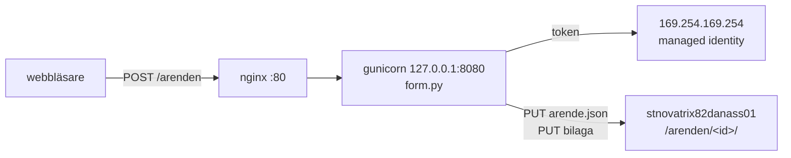

# v37 — Storage

**Daniel Assarélius** · MOV25 · Microsoft Azure · Novatrix AB

Repo: [github.com/82danass/azure](https://github.com/82danass/azure) · Vecka: [v37](https://github.com/82danass/azure/tree/master/v37)

- [x] Uppdatera README för v37
- [x] Skapa storage account + Blob container
- [x] Koppla formuläret till lagringen
- [x] Säkra åtkomsten (managed identity, least privilege)
- [x] Verifiera och dokumentera

## Lagringen

Ärendeformuläret från v34–v36 sparar nu det som skickas in. Ett storage account, `stnovatrix82danass01`, med en container `arenden`, där varje ärende blir en JSON-fil och en eventuell bilaga läggs bredvid den under samma id.

| Val | Värde | Varför |
| --- | --- | --- |
| Kind | `StorageV2` | Standardkontot, det enda som ger Blob med access tiers. |
| Redundans | `Standard_LRS` | Tre kopior i ett datacenter. Miljön rivs varje kväll och ärendena är testdata; att betala för geo-replikering av det vore att betala för fel sak. |
| Access tier | `Hot` | Ett ärende läses strax efter att det skrivits, av den som ska hantera det. `Cool` är billigare per GB men tar betalt per läsning och har minsta lagringstid på 30 dagar. För en handfull kilobyte som läses direkt är Hot både billigast och rätt. |
| Delade nycklar | `allowSharedKeyAccess: false` | Kontonycklarna finns men går inte att använda. Enda vägen in är Entra ID, alltså identiteten. |
| Publik åtkomst | `allowBlobPublicAccess: false`, container `None` | Ingen blob kan göras anonymt läsbar, oavsett vad någon sätter på en enskild container. |
| TLS | `TLS1_2` som lägsta | Äldre klienter nekas. |
| Nätverk | `defaultAction: Deny`, bara `snet-novatrix-web` | Kontot svarar bara på trafik från webbsubnätet. En token från någon annanstans nekas innan den ens kontrolleras. |

Kostnaden är i praktiken noll: några kilobyte i Hot LRS och ett par hundra anrop i månaden. Det som kostar i ett storage account är GB och transaktioner, och ärendeformuläret genererar väldigt lite av båda.

## Åtkomst

Tre lager, och inget av dem är en nyckel.

**Identiteten.** `id-novatrix-app`, den user-assigned managed identity som skapades utan behörighet i v35, får nu exakt en roll: `Storage Blob Data Contributor`, tilldelad på storage-kontot och ingenstans annars. Den rollen är dataplanet, alltså läsa och skriva blobar. Den ger ingenting på kontoresursen, kan inte läsa nycklar, inte ändra nätverksregler, inte ta bort kontot. Identiteten sitter på `vm-novatrix-web`, och ett program på maskinen hämtar en token från Azures metadata-endpoint på `169.254.169.254` utan att någon konfigurerat något på maskinen. Det är hela poängen med managed identity: det finns ingen hemlighet att stjäla, för det finns ingen hemlighet.

Tilldelningen som Azure fick, ur [`arm/rbac.parameters.json`](arm/rbac.parameters.json):

```json
{
  "roleDefinitionId": ".../roleDefinitions/ba92f5b4-2d11-453d-a403-e96b0029c9fe",
  "principalId": "7a8e6487-5747-4113-8ba3-2e536ebbbf00",
  "principalType": "ServicePrincipal",
  "description": "The form writes errands and attachments. Scoped to the storage account rather than the resource group, and granted to the identity rather than to a key, so nothing secret exists to leak.",
  "scope": "Microsoft.Storage/storageAccounts/stnovatrix82danass01"
}
```

**Nätverket.** Kontot har `defaultAction: Deny` och en enda regel: webbsubnätet `10.37.1.0/24`, som bär en service endpoint för `Microsoft.Storage`. Trafik från webbservern går den vägen in i Azures nät och når kontot; allt annat, portalen från min laptop inklusive, stoppas i nätverksregeln innan någon token kontrolleras. Det är v36:s defense in depth fortsatt in i lagringen: även om någon fick tag i en giltig token skulle den inte gå att använda utifrån.

**Inga nycklar.** Med delade nycklar avstängda finns det ingen connection string att läcka, inte i koden, inte i repot, inte i `deploy.env` på maskinen. Kontots namn står där, och det är allt som behövs.

Det här är också varför jag själv, som Owner på prenumerationen, inte kan lista containern från min laptop:

```shell
az storage blob list --account-name stnovatrix82danass01 --container-name arenden --auth-mode login
ERROR:
The request may be blocked by network rules of storage account. Please check network rule set using 'az storage account show -n accountname --query networkRuleSet'.
```

Owner ger rättigheter på kontrollplanet, inte på data, och nätverksregeln stoppar dessutom innan den frågan ställs. Vill granskning se ärendena är svaret en dataroll på kontot till `grp-novatrix-granskning`, inte en nyckel.

## Formuläret

Samma sida som tidigare veckor, med `action="/arenden"` och ett filfält. Bakom nginx står en liten tjänst i Python, [`app/form.py`](app/form.py), som tar emot POST:en, hämtar en token för maskinens identitet och skriver blobarna med ett HTTPS PUT per fil. Inget SDK, inget pip: Flask och gunicorn kommer från apt, och anropen mot Blob-API:t är vanlig `urllib`.



Kärnan i tjänsten, token och skrivning:

```python
IMDS = (
    "http://169.254.169.254/metadata/identity/oauth2/token"
    "?api-version=2018-02-01&resource=https%3A%2F%2Fstorage.azure.com%2F"
)

def token() -> str:
    req = urllib.request.Request(IMDS, headers={"Metadata": "true"})
    with urllib.request.urlopen(req, timeout=10) as answer:
        return json.load(answer)["access_token"]

def put_blob(name: str, data: bytes, content_type: str) -> int:
    url = f"{ENDPOINT}/{CONTAINER}/{urllib.parse.quote(name)}"
    req = urllib.request.Request(url, data=data, method="PUT", headers={
        "Authorization": f"Bearer {token()}",
        "x-ms-version": "2023-11-03",
        "x-ms-blob-type": "BlockBlob",
        "Content-Type": content_type,
    })
    with urllib.request.urlopen(req, timeout=30) as answer:
        return answer.status
```

Var lagringen finns får tjänsten från `/etc/mov/deploy.env`, som mov skriver vid deploy. Kontots namn och endpoint kommer från storage-stegets utdata, inte från något jag skrivit in:

```shell
MOV_ENV=v37
MOV_REPO=82danass/azure
MOV_REF=master
MOV_PATH=v37
MOV_APP_DIR=/opt/mov/app
NOVATRIX_STORAGE_ACCOUNT=stnovatrix82danass01
NOVATRIX_BLOB_ENDPOINT=https://stnovatrix82danass01.blob.core.windows.net/
NOVATRIX_CONTAINER=arenden
```

Tjänsten körs som `www-data` under systemd ([`app/novatrix-form.service`](app/novatrix-form.service)) med `ProtectSystem=strict` och `NoNewPrivileges`, och lyssnar bara på localhost. nginx är det enda som är nåbart utifrån, på port 80, exakt som i v36. `/health` svarar med hur många blobar containern har, vilket är vad verifieringen frågar efter.

## Verifiering

`mov up v37 --set admin.sshSource=80.217.168.6/32`

```shell
up v37 -> rg-novatrix-v37 in swedencentral

1/10 preflight Verify tooling, identity and providers
     OK   rule sources: every source is an address, a network or a tag
     OK   capacity cores: needs 2 more, 4 of 4 free in swedencentral
     OK   capacity public addresses: needs 1 more, 3 of 3 free in swedencentral
     OK   admin exposure: no administrative rule is open to the internet
2/10 rg Create the resource group
     resource group rg-novatrix-v37 created in swedencentral
3/10 network Virtual network, subnets and NSGs
     mov-v37-network-46e0a761
4/10 cost Budget and spend alerts
     mov-v37-cost-1cf2d1b7
5/10 directory Entra ID users and groups (tenant scope)
     group grp-novatrix-drift already exists
     user usr-novatrix-drift@82danassgafemolndal.onmicrosoft.com already exists
6/10 identity User-assigned managed identities
     mov-v37-identity-cf405e1a
7/10 storage Storage account and blob containers
     mov-v37-storage-2a7fac60
8/10 rbac Role assignments
     mov-v37-rbac-8e957bbd
9/10 compute Public IP, NIC and the VM
     OK   generated SSH key D:\MOV25\GitHub\azure\mov-workspace\keys\mov-v37
     mov-v37-compute-web-a5bac812
10/10 verify Prove the deployment answers
     OK   web: http://20.91.138.187/ -> 200 in 59s
     OK   web cloud-init: status: done
     OK   web bootstrap: present
     OK   web nginx: active
     OK   web form service: active
     OK   web form reaches storage: "status":"ok"
     OK   web an errand lands: "status":"stored"
     OK   web pending upgrades: 0
WARN web reboot: exited -1: no answer over ssh within 60s
```

De tre sista OK-raderna är veckans. `form service` är systemd-enheten, `form reaches storage` är `/health` sett från maskinen, och `an errand lands` är ett riktigt ärende som verifieringen skickar genom nginx till tjänsten och vidare till containern. Varningen på slutet är att kärnan uppgraderades under cloud-init och maskinen vill starta om; `rebootIfRequired` är `false` i [`defaults.json`](../mov-workspace/defaults.json), så den väntar på mig.

Sedan skickade jag ett ärende via formuläret i webbläsaren, med en bilaga. Beviset att det hamnade rätt hämtade jag inifrån maskinen, med maskinens egen identitet, eftersom det är den enda som får:

`mov ssh v37`

```shell
azureuser@vm-novatrix-web:~$ TOKEN=$(curl -s -H Metadata:true "http://169.254.169.254/metadata/identity/oauth2/token?api-version=2018-02-01&resource=https%3A%2F%2Fstorage.azure.com%2F" | python3 -c 'import sys,json;print(json.load(sys.stdin)["access_token"])')
azureuser@vm-novatrix-web:~$ curl -s -H "Authorization: Bearer $TOKEN" -H "x-ms-version: 2023-11-03" "https://stnovatrix82danass01.blob.core.windows.net/arenden?restype=container&comp=list" | tr '>' '>\n' | grep -o '<Name>[^<]*'
<Name>20260911T095332Z-5b75c3/arende.json
<Name>20260911T095849Z-3f204c/Installed_Extensions_List.md
<Name>20260911T095849Z-3f204c/arende.json
```

Två ärenden: verifieringens, utan bilaga, och mitt, med. Ärendet är en JSON-fil:

```shell
azureuser@vm-novatrix-web:~$ curl -s -H "Authorization: Bearer $TOKEN" -H "x-ms-version: 2023-11-03" "https://stnovatrix82danass01.blob.core.windows.net/arenden/20260911T095849Z-3f204c/arende.json"
{
  "id": "20260911T095849Z-3f204c",
  "receivedAt": "2026-09-11T09:58:49+00:00",
  "name": "Kalel Anka",
  "email": "assarelius@icloud.com",
  "message": "Testar ett case",
  "attachment": {
    "name": "Installed_Extensions_List.md",
    "bytes": 5328,
    "type": "text/markdown"
  }
}
```

och bilagan ligger bredvid, byte för byte som den skickades:

```shell
azureuser@vm-novatrix-web:~$ curl -s -H "Authorization: Bearer $TOKEN" -H "x-ms-version: 2023-11-03" "https://stnovatrix82danass01.blob.core.windows.net/arenden/20260911T095849Z-3f204c/Installed_Extensions_List.md"
# Installed Extensions Report

This report contains the factual list of all extensions currently installed or active on this machine, ...
```

Samma anrop från min laptop, med mitt eget konto, nekas av nätverksregeln, se *Åtkomst* ovan. Det är de två halvorna av verifieringen: ärendet finns, och bara maskinen kommer åt det.

## Automatisering

Miljön byggs med [mov](https://github.com/Arelius-D/mov), samma harness som tidigare veckor. Profilen ärver v36, så nätverket och NSG-reglerna är desamma, och lägger till det som är nytt: ett `storage`-steg, en rolltilldelning till identiteten, och att webbservern får veta var lagringen finns.

### Profil

[`mov-workspace/profiles/v37.json`](../mov-workspace/profiles/v37.json), det som skiljer från v36:

```json
{
  "env": "v37",
  "extends": "v36",
  "stages": ["preflight", "rg", "network", "cost", "directory", "identity", "storage", "rbac", "compute", "verify"],

  "network": {
    "addressSpace": "10.37.0.0/16",
    "subnets": [
      { "purpose": "web",  "prefix": "10.37.1.0/24", "nsg": "web", "serviceEndpoints": ["Microsoft.Storage"] },
      { "purpose": "data", "prefix": "10.37.2.0/24", "nsg": "data", "private": true }
    ]
  },

  "storage": {
    "seq": 1,
    "sku": "Standard_LRS",
    "kind": "StorageV2",
    "accessTier": "Hot",
    "allowBlobPublicAccess": false,
    "allowSharedKeyAccess": false,
    "minimumTlsVersion": "TLS1_2",
    "containers": [ { "name": "arenden", "publicAccess": "None" } ],
    "network": { "defaultAction": "Deny", "subnets": ["web"], "bypass": ["AzureServices"] }
  },

  "rbac": {
    "assignments": [
      {
        "role": "Storage Blob Data Contributor",
        "principal": { "kind": "managedIdentity", "purpose": "app" },
        "scope": "storageAccount",
        "justification": "The form writes errands and attachments. Scoped to the storage account rather than the resource group, and granted to the identity rather than to a key, so nothing secret exists to leak."
      }
    ]
  },

  "compute": {
    "vms": [
      {
        "purpose": "web",
        "subnet": "web",
        "identities": ["app"],
        "source": { "path": "v37", "bootstrap": "scripts/bootstrap-v37.sh" },
        "host": { "packages": ["git", "nginx", "python3-flask", "gunicorn"] },
        "environment": {
          "NOVATRIX_STORAGE_ACCOUNT": "@output:storage.accountName",
          "NOVATRIX_BLOB_ENDPOINT": "@output:storage.blobEndpoint",
          "NOVATRIX_CONTAINER": "arenden"
        }
      }
    ]
  }
}
```

Service endpointen sitter på webbsubnätet, för det är där programmet kör. Det privata subnätet från v36 är kvar men tomt: ett storage account är en tjänst, inte en maskin, och bor inte i ett subnät. `storage.network` är det som låser kontot till webbsubnätet, och mov vägrar bygga om subnätet inte bär endpointen, i stället för att låta Azure vägra halvvägs. `@output:storage.accountName` betyder att kontots namn tas från vad storage-steget faktiskt skapade och skrivs till maskinen, så det står på ett enda ställe.

Varje rolltilldelning bär sin `justification`, och den skrivs in som beskrivning på tilldelningen i Azure. Den som läser IAM-bladet ser varför identiteten har rollen, inte bara att den har den.

### Bootstrap

[`scripts/bootstrap-v37.sh`](../scripts/bootstrap-v37.sh) körs av cloud-init på första boot, efter att repot klonats. Den lägger `public/` under nginx, `app/form.py` under `/opt/novatrix-form`, installerar systemd-enheten och skriver ett nginx-block där `/arenden` och `/health` går vidare till tjänsten. Paketen kommer från apt via `host.packages`; scriptet installerar bara det som saknas om det körs om för hand.

### Bygga och riva

`admin.sshSource` sätts vid deploy till min adress, så port 22 är öppen mot en enda IP. Adressen från min ISP byter ibland mitt under dagen; då är det `mov up v37 --stage network --set admin.sshSource=<ny>/32` som flyttar regeln, inget annat rörs.

`mov down v37`

```shell
About to delete rg-novatrix-v37 and its 9 resource(s):
  Microsoft.Network/networkSecurityGroups  nsg-novatrix-data
  Microsoft.Network/networkSecurityGroups  nsg-novatrix-web
  Microsoft.Network/virtualNetworks  vnet-novatrix
  Microsoft.ManagedIdentity/userAssignedIdentities  id-novatrix-app
  Microsoft.Storage/storageAccounts  stnovatrix82danass01
  Microsoft.Network/publicIPAddresses  pip-novatrix-web
  Microsoft.Network/networkInterfaces  nic-novatrix-web
  Microsoft.Compute/virtualMachines  vm-novatrix-web
  Microsoft.Compute/disks  vm-novatrix-web_OsDisk_1_80bd84a1eb284609a83ba1ac0e201f54
  Microsoft.Consumption/budgets  budget-novatrix-v37
Delete rg-novatrix-v37? [y/N]: y
OK   deleted budget budget-novatrix-v37
OK   removed ssh entry v37-web
OK   removed key mov-v37
OK   removed key mov-v37.pub
OK   deleting rg-novatrix-v37 (running in the background)
```

Storage-kontot rivs med gruppen, ärendena med det. För en labbmiljö är det rätt: krediten ska gå till det som används, och nästa `mov up v37` bygger exakt samma miljö med samma namn, samma roll på samma identitet och samma nätverksregel. Prenumerationens egen budget och grupperna i Entra ID ligger kvar, de hör inte till miljön.

### Dokumentation

```powershell
mov docs v37                # varje kommando som kördes, med svar
mov templates export v37    # mallarna och parametrarna Azure fick
```

`mov docs` skrev 39 kommandon och ligger inte i repot, transkriptet bär faktureringsuppgifter. [`arm/`](arm/) ligger i repot: [`storage.template.json`](arm/storage.template.json) är kontot och containern, [`storage.parameters.json`](arm/storage.parameters.json) exakt de värden Azure fick, nätverksregeln inklusive, och [`rbac.parameters.json`](arm/rbac.parameters.json) tilldelningen till identiteten med sin motivering.
