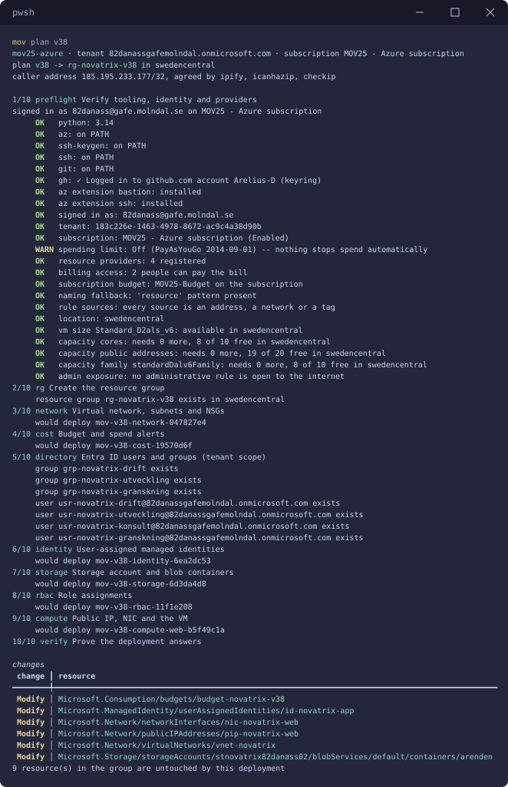
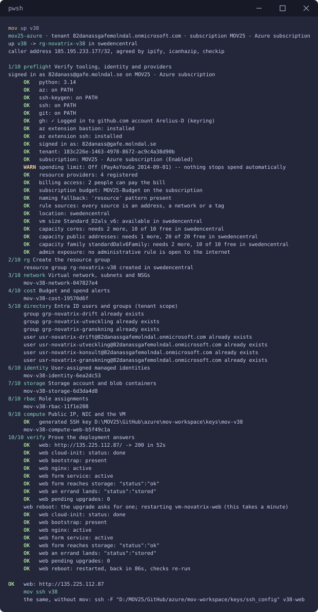
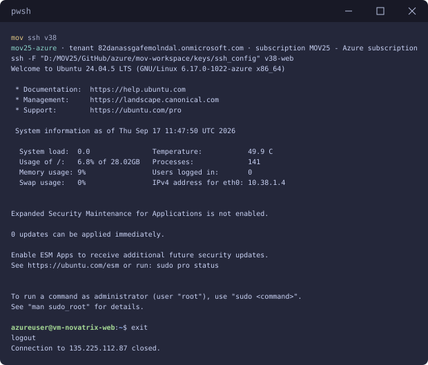
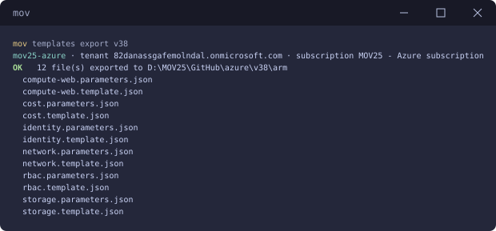
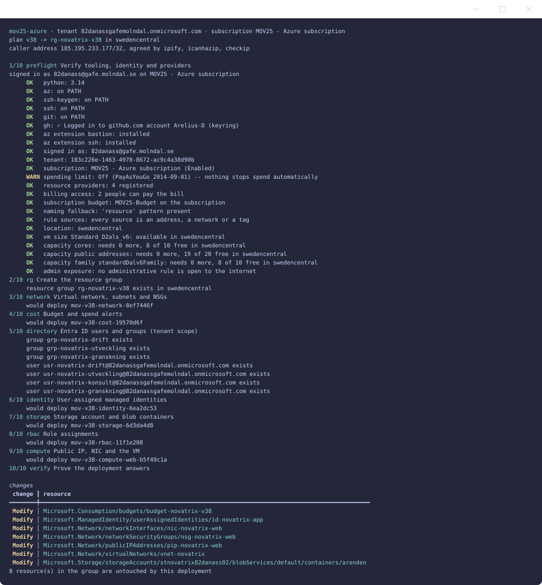
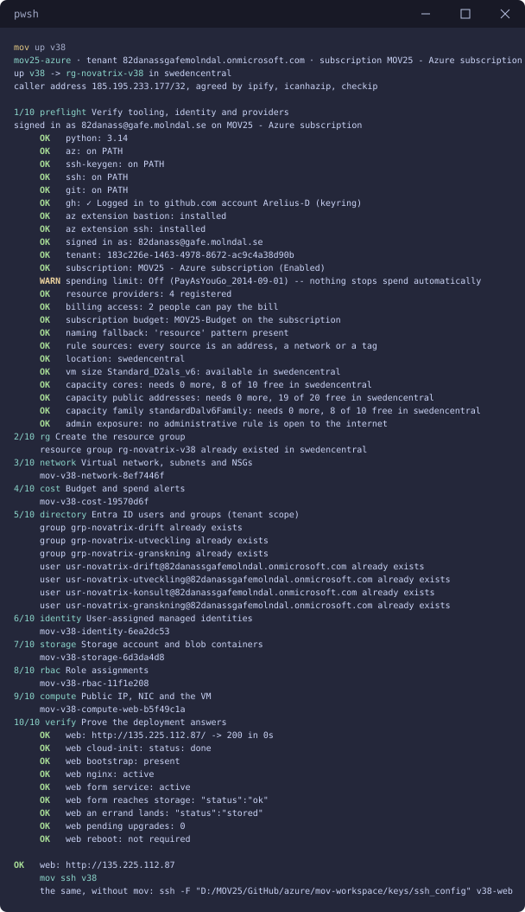
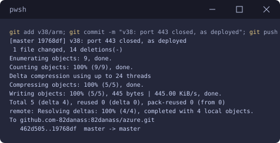
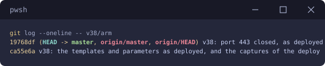
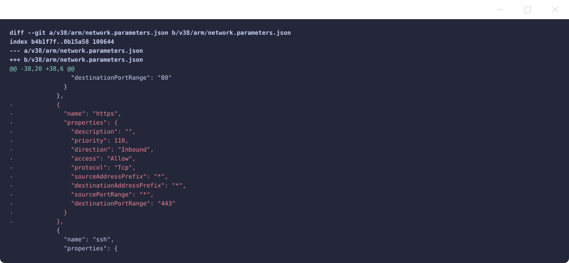
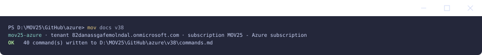

# v38 — IaC med ARM-templates

**Daniel Assarélius** · MOV25 · Microsoft Azure · Novatrix AB

Repo: [github.com/82danass/azure](https://github.com/82danass/azure) · Vecka: [v38](https://github.com/82danass/azure/tree/master/v38)

- [x] Uppdatera README för v38
- [x] Skriv ARM-template(s) för VM, nätverk, storage
- [x] Deploya miljön från kod
- [x] Visa versionshantering (ändring + historik)
- [x] Dokumentera hur miljön återskapas

## Koden

Miljön från v34–v37 har byggts som kod från första veckan: en profil beskriver den, [mov](https://github.com/Arelius-D/mov) renderar ARM-templates ur profilen och deployar dem stegvis, och det Azure faktiskt fick ligger i repot under [`arm/`](arm/). Den här veckan är veckan då det blir poängen i stället för verktyget.

Två lager, med olika jobb:

| Lager | Fil | Vem skriver den | Vad den säger |
| --- | --- | --- | --- |
| Profil | [`mov-workspace/profiles/v38.json`](../mov-workspace/profiles/v38.json) | jag | vad miljön *är*: nät, regler, lagring, identitet, roller, maskin |
| Template | `arm/<steg>.template.json` | mov, samma varje vecka | *hur* Azure bygger ett steg, parametriserat |
| Parametrar | `arm/<steg>.parameters.json` | mov, ur profilen | exakt de värden Azure fick den här gången |

Sex steg, sex templates, tolv filer. Varje template tar allt som varierar som parametrar och innehåller inget namn, ingen adress, ingen region. Nätverkets template tar `location`, `tags`, `vnetName`, `addressSpace`, `networkSecurityGroups` och `subnets`, och bygger NSG:erna i en `copy`-loop över listan den fått:

```json
{
  "type": "Microsoft.Network/networkSecurityGroups",
  "name": "[parameters('networkSecurityGroups')[copyIndex()].name]",
  "copy": { "name": "securityGroups", "count": "[length(parameters('networkSecurityGroups'))]" },
  ...
},
{
  "type": "Microsoft.Network/virtualNetworks",
  "name": "[parameters('vnetName')]",
  "dependsOn": [ "securityGroups" ],
  ...
}
```

Samma template byggde v35, v36 och v37: `network.template.json` är byte för byte densamma i alla tre veckornas `arm/`. Det som skiljer veckorna är parameterfilerna, och parameterfilerna kommer ur profilen. Det är vad återanvändbarhet betyder här: en ny miljö är en ny profil, inte en ny template.

| Steg | Template | Provisionerar |
| --- | --- | --- |
| network | [`network.template.json`](arm/network.template.json) | VNet `10.38.0.0/16`, två subnät, två NSG:er med sina regler |
| cost | [`cost.template.json`](arm/cost.template.json) | budget på resursgruppen med larm |
| identity | [`identity.template.json`](arm/identity.template.json) | `id-novatrix-app`, appens managed identity |
| storage | [`storage.template.json`](arm/storage.template.json) | `stnovatrix82danass02`, container `arenden`, nätverkslåst till webbsubnätet |
| rbac | [`rbac.template.json`](arm/rbac.template.json) | rollerna från v35 och identitetens `Storage Blob Data Contributor` |
| compute | [`compute-web.template.json`](arm/compute-web.template.json) | publik IP, NIC, VM med identiteten och cloud-init |

Profilen för v38 ärver v37 och ändrar bara det som är veckans:

```json
{
  "env": "v38",
  "extends": "v37",
  "network": { "addressSpace": "10.38.0.0/16", "subnets": [ ...10.38.1.0/24 web, 10.38.2.0/24 data... ] },
  "storage": { "seq": 2 },
  "compute": {
    "vms": [ {
      "purpose": "web",
      "size": "Standard_D2als_v6",
      "identities": [ "app" ],
      "source": { "path": "v38", "bootstrap": "scripts/bootstrap-v37.sh" },
      "host": { "packages": [ "git", "nginx", "python3-flask", "gunicorn" ],
                "updatePackages": true, "upgradePackages": true, "rebootIfRequired": true },
      "environment": {
        "NOVATRIX_STORAGE_ACCOUNT": "@output:storage.accountName",
        "NOVATRIX_BLOB_ENDPOINT": "@output:storage.blobEndpoint",
        "NOVATRIX_CONTAINER": "arenden"
      }
    } ]
  }
}
```

`@output:storage.accountName` betyder att maskinen får kontots namn från vad storage-steget faktiskt skapade. Det står på ett ställe, i profilen, och templates och parametrar följer.

Storleken är `Standard_D2als_v6` och inte `Standard_B2ts_v2` som tidigare veckor. Prenumerationen gick från Free Trial till Pay-As-You-Go den här veckan, och med det fick varje B-seriens v2-familj kvot 0 medan B-seriens v1 inte längre erbjuds prenumerationen alls. D2als_v6 är den billigaste storleken med kvot. Det är en rad i profilen, och preflight säger numera till innan resursgruppen skapas om familjen saknar kvot, inte efter.

## Deploy från kod

`mov plan v38` innan något finns: varje steg svarar *would deploy*, och ingenting skapas.



`mov up v38`



Samma körning som text, att kopiera ur. Verktygskontrollerna i preflight är utelämnade, de är
desamma varje vecka:

```shell
up v38 -> rg-novatrix-v38 in swedencentral
caller address 185.195.233.177/32, agreed by ipify, icanhazip, checkip

1/10 preflight Verify tooling, identity and providers
     OK   capacity cores: needs 2 more, 10 of 10 free in swedencentral
     OK   capacity family standardDalv6Family: needs 2 more, 10 of 10 free in swedencentral
     OK   admin exposure: no administrative rule is open to the internet
2/10 rg Create the resource group
     resource group rg-novatrix-v38 created in swedencentral
3/10 network Virtual network, subnets and NSGs
     mov-v38-network-047827e4
4/10 cost Budget and spend alerts
     mov-v38-cost-19570d6f
5/10 directory Entra ID users and groups (tenant scope)
     group grp-novatrix-drift already exists
     user usr-novatrix-drift@82danassgafemolndal.onmicrosoft.com already exists
6/10 identity User-assigned managed identities
     mov-v38-identity-6ea2dc53
7/10 storage Storage account and blob containers
     mov-v38-storage-6d3da4d8
8/10 rbac Role assignments
     mov-v38-rbac-11f1e208
9/10 compute Public IP, NIC and the VM
     mov-v38-compute-web-b5f49c1a
10/10 verify Prove the deployment answers
     OK   web: http://135.225.112.87/ -> 200 in 52s
     OK   web cloud-init: status: done
     OK   web bootstrap: present
     OK   web nginx: active
     OK   web form service: active
     OK   web form reaches storage: "status":"ok"
     OK   web an errand lands: "status":"stored"
     OK   web pending upgrades: 0
     web reboot: the upgrade asks for one; restarting vm-novatrix-web (this takes a minute)
     OK   web cloud-init: status: done
     OK   web bootstrap: present
     OK   web nginx: active
     OK   web form service: active
     OK   web form reaches storage: "status":"ok"
     OK   web an errand lands: "status":"stored"
     OK   web pending upgrades: 0
     OK   web reboot: restarted, back in 86s, checks re-run

OK   web: http://135.225.112.87
     mov ssh v38
```

Formuläret nåbart och lagringen på plats är de två sista OK-raderna före omstarten: `/health` svarar från tjänsten, och ett ärende skickat genom nginx till tjänsten hamnar i containern. `caller address` är den adress ssh-regeln låses till; profilen säger `@caller` och mov tar reda på den vid varje körning i stället för att jag skriver in den.

Omstarten är veckans andra IaC-poäng. Uppgraderingen som cloud-init kör drog in en ny kärna, och en kod som beskriver en miljö får inte ge olika resultat beroende på vilken dag Ubuntu-avbilden byggdes. Så efter att alla kontroller gått igenom frågar mov maskinen om den är skyldig en omstart, startar om den via Azure när profilen säger `rebootIfRequired: true`, väntar in sidan och kör varje kontroll igen på den maskin som faktiskt kommer att köra. Samma profil, samma slutläge, varje gång.

`mov ssh v38`



`mov templates export v38` skriver de tolv filerna till `arm/`, och det är version ett av templates i repot:



## Versionshantering

Ändringen: stäng port 443. Regeln `https` har varit öppen sedan v36 med motiveringen *reserverad för TLS*, och inget har någonsin serverat TLS på maskinen. En öppen port till en tjänst som inte finns är precis vad en granskning frågar om, så den går. I profilen är det sju rader som försvinner:

```diff
         { "name": "http",  "priority": 100, "ports": ["80"] },
-        { "name": "https", "priority": 110, "ports": ["443"] },
         { "name": "ssh",   "priority": 120, "ports": ["22"], "source": "${admin.sshSource}" },
```

`mov plan v38` innan något rörs:



Azures what-if listar *Modify* på sju resurser. Det är känt beteende: what-if jämför templatens text mot resursens och räknar normaliserade skillnader som ändringar. Den ärliga signalen är deploymentnamnen. mov namnger varje deployment efter innehållet, och i `mov up` efteråt får nätverket ett nytt namn medan varje annat steg behåller exakt det namn det hade:

| Steg | Före | Efter |
| --- | --- | --- |
| network | `mov-v38-network-047827e4` | `mov-v38-network-8ef7446f` |
| cost | `mov-v38-cost-19570d6f` | samma |
| identity | `mov-v38-identity-6ea2dc53` | samma |
| storage | `mov-v38-storage-6d3da4d8` | samma |
| rbac | `mov-v38-rbac-11f1e208` | samma |
| compute | `mov-v38-compute-web-b5f49c1a` | samma |

`mov up v38`, hela kedjan i en rad: deploy, export, commit, push, historik, diff.

```powershell
mov plan v38; mov up v38; mov templates export v38; cd D:\MOV25\GitHub\azure; git add v38/arm; git commit -m "v38: port 443 closed, as deployed"; git push; git log --oneline -- v38/arm; git diff HEAD~1 -- v38/arm/network.parameters.json
```



`mov templates export v38` skriver samma tolv filer igen, och det är version två.



Historiken och diffen, som repot bär dem:





```shell
git log --oneline -- v38/arm
19768df v38: port 443 closed, as deployed
ca55e6a v38: the templates and parameters as deployed, and the captures of the deploy
```

Och i Azure, efter deployen:

```shell
az network nsg rule list -g rg-novatrix-v38 --nsg-name nsg-novatrix-web -o table
Name              Priority    Port    Source              Access
----------------  ----------  ------  ------------------  --------
http              100         80      *                   Allow
ssh               120         22      185.195.233.177/32  Allow
deny-all-inbound  4000        *       *                   Deny
```

**Vad versionshanteringen ger drift och samarbete.** Frågan *varför är 443 öppen?* besvaras av `git log`: v36 reserverade den för TLS, v38 stängde den, med commit-meddelandet som skäl. Ingen behöver minnas det, ingen behöver fråga. En ändring är en diff som kan läsas och granskas innan den deployas, och `mov plan` visar vad Azure kommer att göra med den. Går något fel är `git revert` plus `mov up` vägen tillbaka till en miljö som bevisligen fungerade, för dess parametrar ligger i repot. Två personer som ändrar samma NSG får en merge-konflikt i stället för att skriva över varandra i portalen. Och deploymentnamnen gör repot och Azure jämförbara: samma innehåll, samma namn.

## Återskapa miljön

Från repot, utan portal:

```powershell
git clone https://github.com/82danass/azure.git
cd azure
az login
mov check          # verktyg, inloggning, prenumeration, kvoter
mov up v38         # hela miljön, verifierad
```

mov läser [`mov-workspace/`](../mov-workspace/) i repot: prenumerationen den är låst till, namnkonventionen, standardvärdena, profilerna. Nycklar och deploymentstate skrivs lokalt och ligger inte i repot. `mov up v38` gör allt ovan: tio steg, ett ärende genom formuläret, omstarten om avbilden kräver en. `mov down v38` river resursgruppen och tar budgeten och nycklarna med sig; grupperna i Entra ID och prenumerationens budget hör inte till miljön och står kvar.

Det som ligger i `arm/` går också att deploya med `az` direkt, steg för steg i ordningen ovan:

```powershell
az group create -n rg-novatrix-v38 -l swedencentral
az deployment group create -g rg-novatrix-v38 -f v38/arm/network.template.json -p @v38/arm/network.parameters.json
az deployment group create -g rg-novatrix-v38 -f v38/arm/storage.template.json -p @v38/arm/storage.parameters.json
...
```

Med en reservation som är värd att skriva ut: parameterfilerna är ett protokoll över en deploy, inte en mall för nästa. `rbac.parameters.json` bär identitetens principal-id och `compute-web.parameters.json` den publika nyckeln, och båda är nya varje gång identiteten och nyckeln skapas om. Det är exakt de värden mov löser vid deploy, och skälet till att profilen är källan och `arm/` är kvittot.

## Automatisering

### Dokumentation

```powershell
mov docs v38                # varje kommando som kördes, med svar
mov templates export v38    # mallarna och parametrarna Azure fick
```



`mov docs` skrev 40 kommandon och ligger inte i repot; transkriptet bär faktureringsuppgifter. [`arm/`](arm/) ligger i repot, i två versioner.

### Rivning

`mov down v38` efter dokumentationen. Resursgruppen med sina nio resurser går, budgeten och nycklarna med den. Nästa `mov up v38` bygger samma miljö igen, med samma namn, samma regler och samma slutläge, för det är vad koden säger.
