# v39 — Automation och integration

**Daniel Assarélius** · MOV25 · Microsoft Azure · Novatrix AB

Repo: [github.com/82danass/azure](https://github.com/82danass/azure) · Vecka: [v39](https://github.com/82danass/azure/tree/master/v39)

- [x] Uppdatera README för v39
- [ ] Bygg Power Automate-flöde (trigger vid nytt ärende)
- [ ] Integrera mot Microsoft 365 (SharePoint-lista, Teams/Outlook-notis)
- [ ] Koppla flödet till Azure-lösningen
- [x] Verifiera och dokumentera hela kedjan

## Vägvalet

Uppgiften är skriven för en organisation där Microsoft 365 och Azure ligger i samma katalog: ett Power Automate-flöde triggas när ett ärende kommer in, skriver det i en SharePoint-lista och skickar en notis i Teams. Min Microsoft 365-tenant (med Power Automate) och min Azure-prenumeration ligger i två olika kataloger, och det går inte att ändra: en kostnadsfri Azure-prenumeration kan inte skapas inifrån en Microsoft 365-tenant, och Microsofts *Change directory* på den prenumeration jag har slutade i *This request is no longer valid* utan något att klicka på. Det är dokumenterat, med konton och id:n, i en fil som inte ligger i repot.

Så veckan är byggd som en integration mellan två världar som inte delar identitet, vilket är det vanliga fallet mellan ett företag och dess leverantörer. Ärendekön ligger i Azure, som kod, i samma miljö som formuläret. Det enda som korsar gränsen till Microsoft 365 är det enda som kan korsa den: en webhook. Ett Workflows-flöde i Teams (Power Automate under huven) tar emot den och postar ärendet i kanalen. Avstämt med läraren: Teams ska vara med i processen, och det är den.

Det som ersätter SharePoint-listan är ett ärenderegister, [NocoDB](https://github.com/nocodb/nocodb), på en egen maskin utan en enda öppen port. Kundtjänst når det på `https://mov25-tickets.assarelius.org` genom en Cloudflare-tunnel, bakom en inloggning där Entra ID i min tenant är identitetsleverantör. Dörren släpper bara fram den som loggat in med Entra ID; innanför den har NocoDB sin egen inbyggda inloggning och användarhantering, och där loggar man in med ett konto i NocoDB. Att bygga om NocoDB:s inloggning till Entra ID, med behörigheter därifrån, valde jag att lämna utanför uppgiften.

## Kedjan

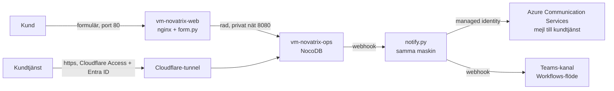

| Del | Var | Vad |
| --- | --- | --- |
| Formuläret | `vm-novatrix-web`, publik | Samma sida som v34–v38, med bilagan från v37 och v38 (valfri, högst 10 MB). `POST /arenden` går till [`app/form.py`](app/form.py), som laddar upp bilagan till registrets lagring, skriver ärendet som en rad i registret med bilagan på raden, och svarar med ärendenumret. |
| Registret | `vm-novatrix-ops`, ingen öppen port | NocoDB i Docker, basen `Novatrix`, tabellen `Arenden` med Name, Email, Message, Status (`ny`, `pagaende`, `klar`), Received, HandledBy och Attachment, kundens bilaga. Bas, tabell och webhook skapas av [`ops/on-secrets.sh`](ops/on-secrets.sh) första gången maskinen får sina hemligheter. |
| Dörren | Cloudflare | Tunneln ger registret ett värdnamn utan att öppna en port. Cloudflare Access framför värdnamnet kräver inloggning, och identitetsleverantören är en appregistrering i min Entra-tenant som mov skapar. NSG:n på ops släpper in 8080 från webbsubnätet och 22 från min adress, inget annat. |
| Notisen | `vm-novatrix-ops` | [`ops/notify.py`](ops/notify.py) tar webhooken, skickar mejl genom Azure Communication Services med maskinens managed identity, och postar ett Adaptive Card i Teams genom Workflows-flödet. |
| Kundtjänst | Entra ID | Gruppen `grp-novatrix-support` och användaren *Andreas Svenberg (support)*, `usr-novatrix-support@…onmicrosoft.com`, med ett utgångsdatum mov bevakar. Gruppen har *Reader* på resursgruppen: kundtjänst arbetar i kön, inte i Azure. |

## Registret

Varför NocoDB och inte en SharePoint-lista: listan skulle ligga i Microsoft 365, och då måste flödet som skriver i den nås från Azure med en identitet Azure inte har. Ett register i samma miljö som formuläret skrivs med en identitet miljön äger, och kön är en tabell med ett gränssnitt kundtjänst kan arbeta i: status per ärende, vem som tog det, filter och vyer.

Maskinen som kör det har ingen inkommande port från internet. Tunneln, `cloudflared`, ringer ut till Cloudflare och tar emot trafiken för `mov25-tickets.assarelius.org` därifrån, och Access framför värdnamnet svarar `302` till inloggning på allt som inte har en session. Inloggningen är Entra ID: Access är registrerat som en app i tenanten, med klienthemligheten som en hemlighet mov gjorde och lagrade, och Access callback-adress som redirect URI. Andreas loggar in med sin användare i tenanten; det första lösenordet skrev mov till workspace-nycklarna, det är engångs och byts vid första inloggningen, och tenantens säkerhetsstandard kräver att han registrerar Authenticator då. Ingen annan kommer in.

Värdnamnen är ett ord med bindestreck, `mov25-form` och `mov25-tickets`, i stället för en undernivå, `form.mov25`. Första körningen använde undernivån, och webbläsaren svarade `ERR_SSL_VERSION_OR_CIPHER_MISMATCH`: Cloudflares kostnadsfria certifikat täcker `*.assarelius.org`, en nivå, och erbjuder inget alls för en andra. mov fick ett `prefix` i sin Cloudflare-konfiguration för det, och preflight varnar numera om man väljer undernivån.

Registrets superadmin är `admin@novatrix.se` med ett lösenord som ligger i workspace-hemligheterna, aldrig i repot. Formuläret skriver med den sessionen över det privata nätet. Den som kommer igenom dörren loggar in i NocoDB med ett konto i NocoDB: Access avgör vem som når registret, NocoDB vem som gör vad i det.

## Notisen

**Mejlet.** Azure Communication Services med en Azure-hanterad domän, `DoNotReply@<id>.azurecomm.net`, och kundtjänstens adress som mottagare. Maskinens managed identity `id-novatrix-notify` har rollen *Communication and Email Service Owner* på resursgruppen; det är rollen tjänsten själv definierar, och den enda identiteten som kan skicka. Avsändaradressen och tjänstens värdnamn läser notifieraren ur resurserna vid start, med samma identitet. Ingen nyckel finns att läcka. Gratisnivån tar tio mejl i timmen, vilket räcker för en ärendekö på prov.

**Teams.** Office 365-connectorerna i Teams pensionerades i maj 2026, och det som finns kvar för en webhook in i en kanal är ett Workflows-flöde, alltså Power Automate. Flödet skapas i Teams, inte i kod:

1. I Teams, i kanalen som ska ha notiserna: `⋯` på kanalnamnet → **Workflows**.
2. Välj mallen **Post to a channel when a webhook request is received**.
3. Ge flödet ett namn, välj team och kanal, **Add workflow**. Teams visar en URL; den är flödets trigger och ska behandlas som en hemlighet.
4. `mov secrets set v39-cf TEAMS_WEBHOOK_URL`, klistra in adressen, och lägg `TEAMS_WEBHOOK_URL` sist i ops-maskinens `secrets` i profilen. Nästa `mov up v39-cf` levererar den till maskinen, och notifieraren börjar posta.

Kortet flödet postar är ett Adaptive Card med ärendenummer, avsändare, mottagningstid, meddelandet och en knapp *Öppna kön* som leder till registret. Utan URL:en skickas mejlet ändå; notifieraren svarar `teams: no url` och går vidare.

## Koden

Profilen [`mov-workspace/profiles/v39-cf.json`](../mov-workspace/profiles/v39-cf.json), med det som är veckans; [`v39.json`](../mov-workspace/profiles/v39.json) är samma kedja utan Cloudflare. Samma workspace som v34–v38: den nya tenanten och prenumerationen står i samma `mov.workspace.json`, med sin egen `tenantId`, och den prenumeration en körning riktas mot avgör i vilken tenant den körs. `mov subscription pin "MOV25 - v39-v41"` för veckorna 39–41, `mov subscription pin "MOV25 - Azure subscription"` tillbaka.

```json
{
  "env": "v39",
  "stages": ["preflight", "rg", "network", "cost", "directory", "identity", "applications", "cloudflare", "resources", "rbac", "compute", "verify"],

  "identity": {
    "userAssigned": [ { "purpose": "notify" } ],
    "applications": [ { "purpose": "signin", "claims": { "email": true, "groups": true }, "secret": "OAUTH_CLIENT_SECRET" } ]
  },
  "cloudflare": {
    "records": [ { "name": "form", "host": "web" } ],
    "tunnel": { "host": "ops", "secret": "TUNNEL_TOKEN", "routes": [ { "name": "tickets", "service": "http://127.0.0.1:8080" } ] },
    "access": [ { "name": "tickets", "idp": "signin", "allow": { "everyone": true } } ]
  },
  "resources": [
    { "type": "Microsoft.Communication/emailServices", "purpose": "mail", ... },
    { "type": "Microsoft.Communication/emailServices/domains", "purpose": "maildomain", "name": "mail-novatrix-v39/AzureManagedDomain", ... },
    { "type": "Microsoft.Communication/communicationServices", "purpose": "acs", "properties": { "linkedDomains": ["@resourceId:maildomain"] } }
  ],
  "compute": {
    "vms": [
      {
        "purpose": "ops", "size": "Standard_B2ls_v2", "identities": ["notify"],
        "environment": {
          "NOVATRIX_TICKET_HOST": "@output:cloudflare.hosts.tickets",
          "AZURE_CLIENT_ID": "@output:identity.identities.notify.clientId",
          "NOVATRIX_ACS_ID": "@output:resources.acsId",
          "NOVATRIX_MAIL_DOMAIN_ID": "@output:resources.maildomainId"
        },
        "secrets": ["TUNNEL_TOKEN", "NC_AUTH_JWT_SECRET", "NC_ADMIN_PASSWORD"],
        "verify": { "http": false, "host": [ ...cloud-init, secrets landed, registry, tunnel, door closed to anonymous, notifier reaches mail... ] }
      },
      { "purpose": "web", "environment": { "NOVATRIX_TICKETS_URL": "http://vm-novatrix-ops:8080" }, "secrets": ["NC_ADMIN_PASSWORD"], ... }
    ]
  }
}
```

Tre saker i profilen är nya för veckan och fanns inte i mov när den började:

| Block | Vad mov gör | Rivs av `mov down` |
| --- | --- | --- |
| `identity.applications` | En appregistrering i Entra, med service principal och en klienthemlighet som skapas en gång och lagras som workspace-hemlighet. Redirect URI sätts efter compute, när adressen finns. | ja |
| `cloudflare` | En DNS-post per maskin som ska ha ett namn, en tunnel för maskinen som inte ska ha en port (dess token lagras som hemlighet och levereras till maskinen), och en Access-app med policy och Entra som identitetsleverantör. Allt hittas på namn innan det skapas och tas bort på id; inget annat i zonen listas ens. | ja, exakt det som skapades |
| `secrets` på en maskin | Hemligheterna levereras efter boot, över ssh till `/etc/mov/secrets.env` (root, `0600`), aldrig genom cloud-init där de hade hamnat i Azures metadata. En `systemd`-path-enhet på maskinen startar det som behöver dem i samma sekund filen finns. | med maskinen |

`@output:cloudflare.hosts.tickets` betyder att maskinen får sitt värdnamn från vad Cloudflare-steget faktiskt skapade, på samma sätt som `@output:storage.accountName` i v38. Tunnelns token, appens hemlighet, registrets lösenord: `mov secrets list v39` visar vilka som finns och var de kommer ifrån, aldrig värdena.

| Fil | Kör på | Gör |
| --- | --- | --- |
| [`scripts/bootstrap-v39-ops.sh`](../scripts/bootstrap-v39-ops.sh) | ops, cloud-init | swap, Docker, `cloudflared`, NocoDB-avbilden, notifierarens venv, enheterna. Startar inget som behöver en hemlighet. |
| [`ops/on-secrets.sh`](ops/on-secrets.sh) | ops, när hemligheterna landat | startar registret, ser till att bas, tabell och webhook finns, kopplar tunneln med sin token, startar notifieraren. Körs om utan att göra om det som finns. |
| [`ops/notify.py`](ops/notify.py) | ops | webhooken in, mejl och Teams-kort ut. `/health` säger avsändare, mottagare, om Teams-URL finns, och hur många som skickats. |
| [`scripts/bootstrap-v39-web.sh`](../scripts/bootstrap-v39-web.sh) | web, cloud-init | nginx med formuläret, formulärtjänsten installerad men startad först när registrets lösenord landat. |
| [`app/form.py`](app/form.py) | web | `POST /arenden` blir en rad i registret. `/health` räknar öppna ärenden. |

## Deploy från kod

Två miljöer ur samma kod: `v39` utan Cloudflare, och `v39-cf` med tunneln, dörren och formulärets eget värdnamn och certifikat. De är två profiler med var sitt namn på allt.

### v39, utan Cloudflare

`mov up v39`

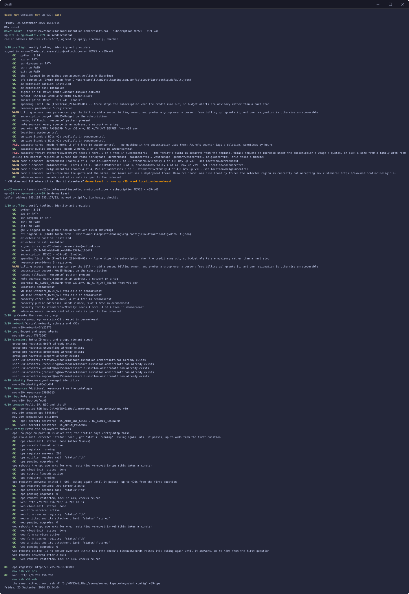

Sweden Central räknade fortfarande två kärnor som använda efter förra rivningen, fast ingen maskin fanns. mov frågade de närmaste regionerna, visade vilka som hade plats, och körningen gick i Denmark East. Utan Cloudflare står ingen dörr framför registret: det nås på ops-maskinens adress, port 8080, bara från min adress, och NocoDB:s eget adminkonto är enda inloggningen.

`mov status v39` efteråt: varje steg lyckades, och varje kontroll på båda maskinerna godkändes, också att ett ärende med bilaga landar som en rad i registret.

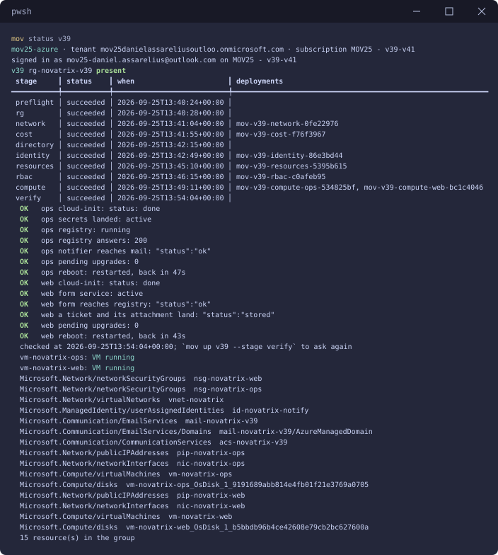

På ops-maskinen kör NocoDB i Docker, och notifieraren loggar att mejlet för ärende 2 gick iväg: `'mail': 'Succeeded'`. `'teams': 'no url'` är läget tills Workflows-flödet finns.

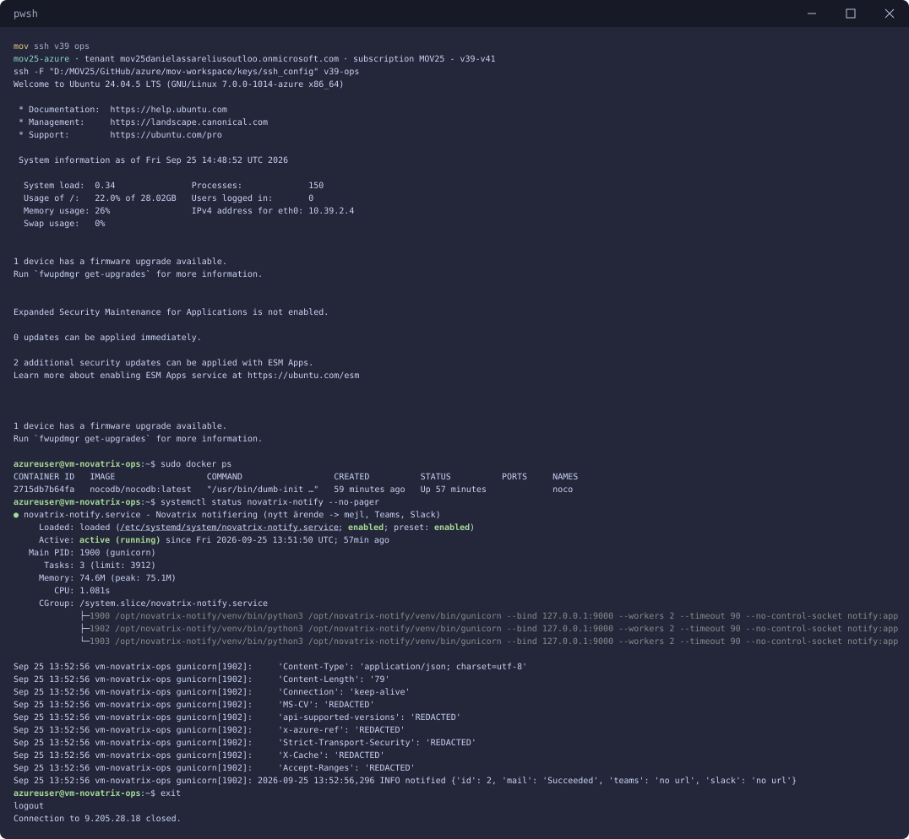

På web-maskinen kör formulärtjänsten, och `/health` svarar att registret nås och att två ärenden är öppna.

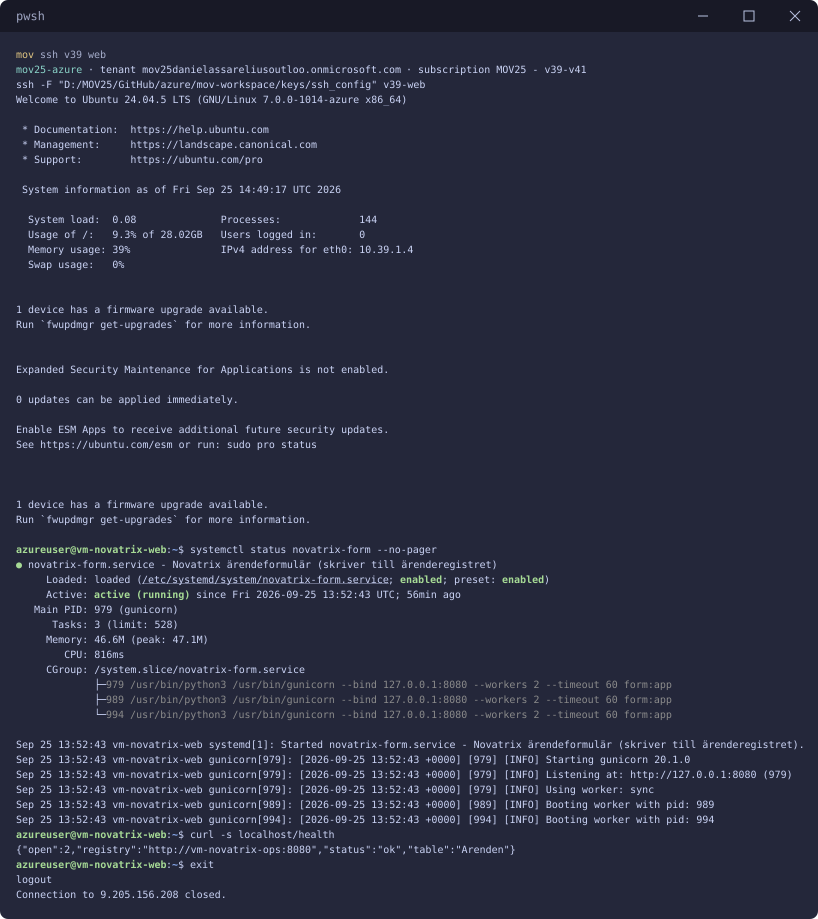

### v39-cf, med Cloudflare

`mov up v39-cf`

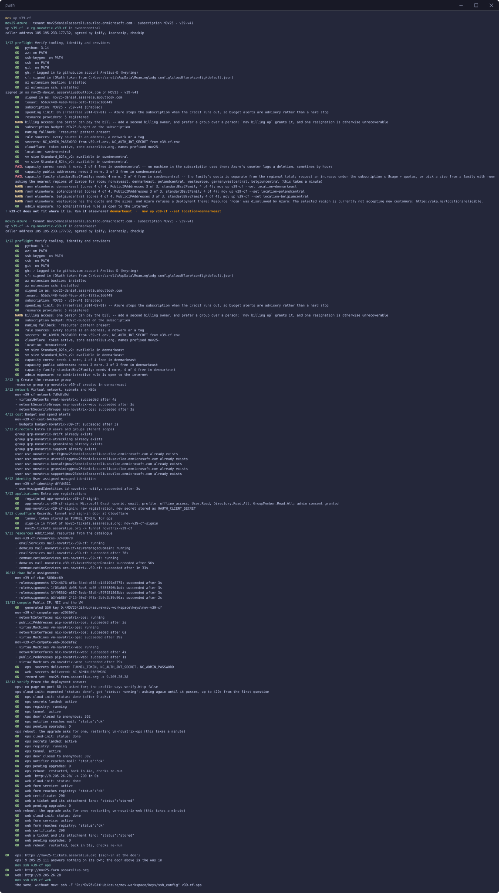

Sweden Central sa nej igen: två av fyra kärnor räknades som använda fast ingen maskin fanns i prenumerationen. mov frågade de närmaste regionerna (West Europe hade plats men tar inte emot nya kunder) och körningen gick i Denmark East. Steg 7 registrerar appen som dörren loggar in genom, med Cloudflares sju rättigheter mot Microsoft Graph. Raden säger att samtycket gavs, och det stämde inte: se `AADSTS650056` i tabellen under *Verifiering*. Steg 8 gör tunneln, dörren framför `mov25-tickets.assarelius.org` och formulärets post. Verifieringen väntade in ops-maskinens cloud-init, nio frågor, och båda maskinerna fick den omstart uppgraderingen bad om, varefter varje kontroll kördes igen på maskinen som faktiskt kör.

Vad raderna bevisar, i ordning: på ops är cloud-init klar, hemligheterna landade och notifieraren startade, registret kör, tunneln är uppe, dörren svarar `302` till en anonym besökare, och notifieraren når mejltjänsten. På web är formulärtjänsten igång, den når registret över det privata nätet, formulärets namn svarar över HTTPS med maskinens eget certifikat, och ett ärende med bilaga skickat genom nginx hamnar som en rad.

`mov status v39-cf` efteråt: varje steg lyckades, och varje kontroll på båda maskinerna godkändes, också certifikatet och att ett ärende med bilaga landar.

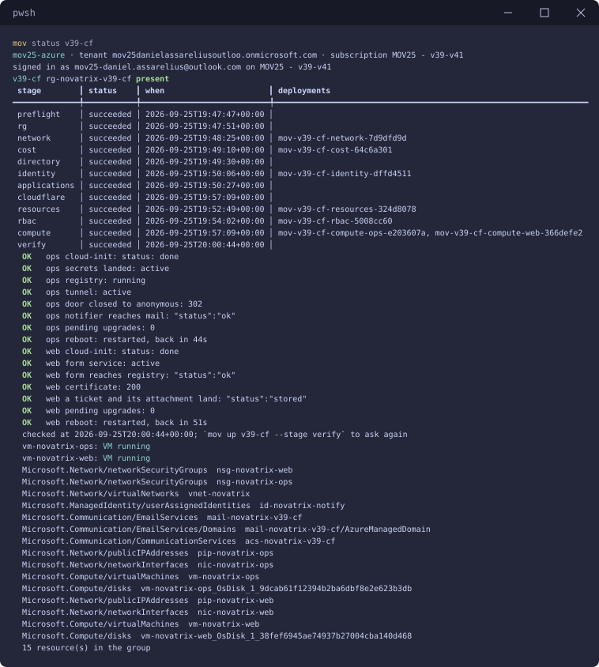

Genom dörren på `mov25-tickets.assarelius.org`: inloggningen med Entra ID hos Cloudflare, sedan NocoDB:s egen inloggning, här som admin, och basen `Novatrix`.

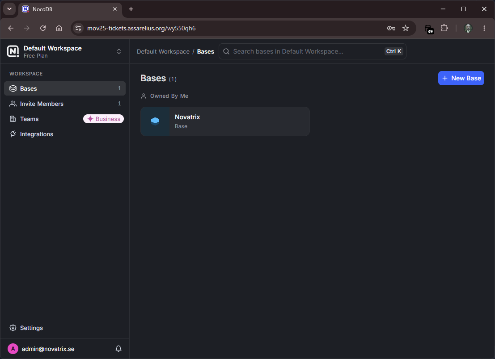

Tabellen `Arenden` med tre rader: verifieringens två ärenden, vart och ett med sin textbilaga, och ett ärende från formuläret med en PDF.

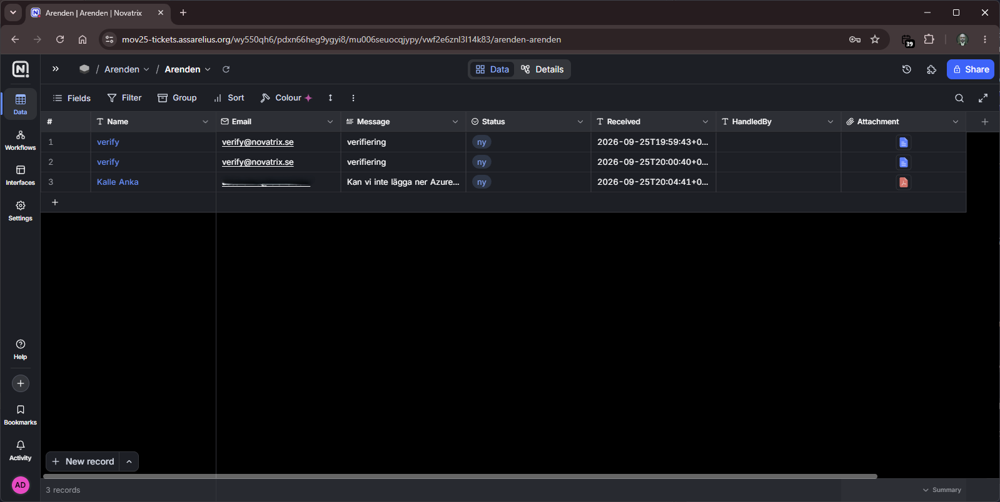

Bilagan öppnas direkt från raden.

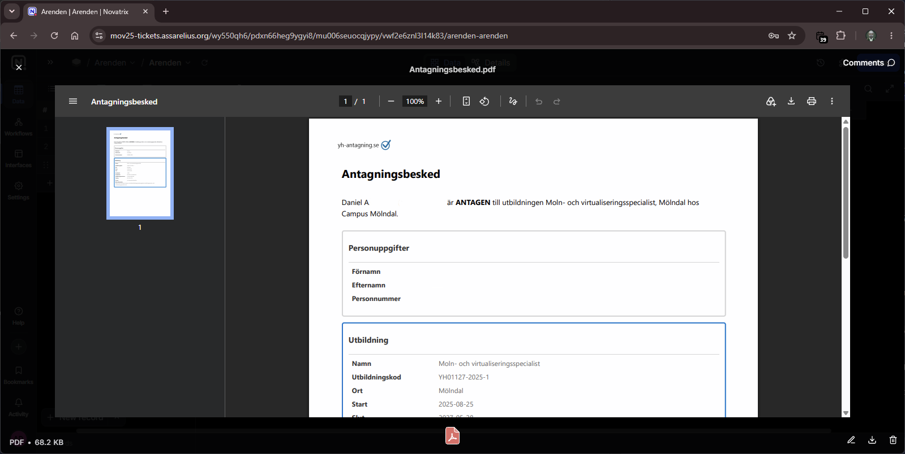

På ops-maskinen kör NocoDB i Docker, tunneln `cloudflared` är uppe, och notifieraren loggar att mejlet för ärende 3 gick iväg: `'mail': 'Succeeded'`. Registret frågat över sitt eget API visar samma tre rader och deras bilagor.

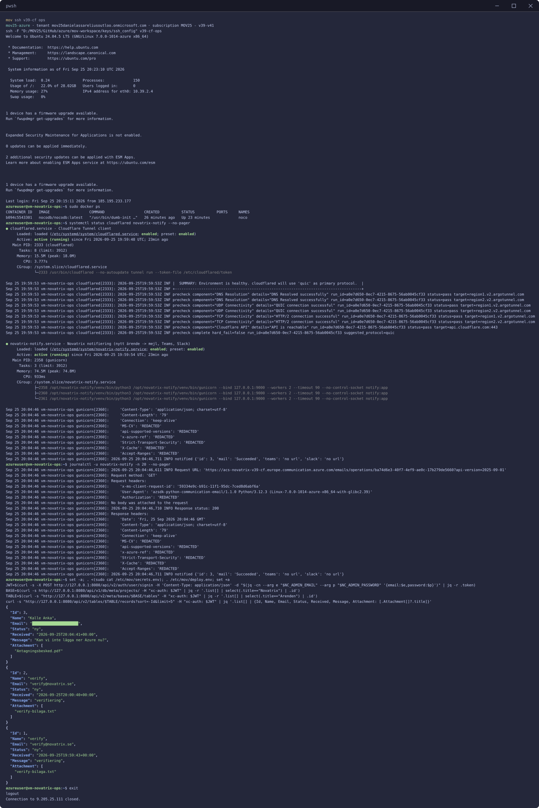

På web-maskinen kör formulärtjänsten och nginx, `/health` svarar att registret nås och att tre ärenden är öppna, Let's Encrypt-certifikatet för `mov25-form.assarelius.org` gäller i 89 dagar till, och `https://` svarar `HTTP/2 200`.

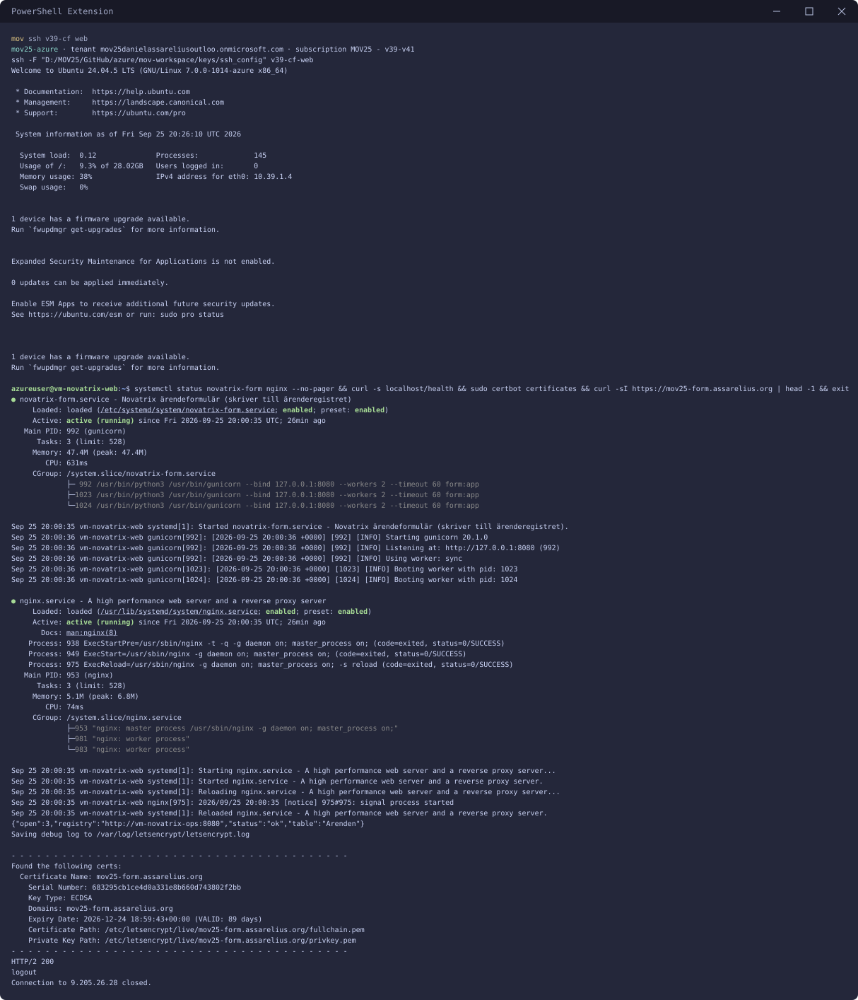

## Verifiering

Kedjan, med ett ärende genom formuläret:

```shell
curl -sF name=Kedjetest -F email=kund@example.org -F "message=Provbiljett" "https://mov25-form.assarelius.org/arenden?format=json"
{"id":4,"status":"stored"}
```

Registret anropar webhooken, notifieraren mejlar och svarar; registrets egen logg över webhooken visar vad notifieraren svarade:

```json
{"handled":1,"outcomes":[{"id":4,"mail":"Succeeded","slack":"no url","teams":"no url"}]}
```

`mail: Succeeded` är Communication Services eget statusord för ett levererat mejl. `teams: no url` är läget tills Workflows-flödet finns.

Dörren: `https://mov25-tickets.assarelius.org` utan session svarar `302` till Cloudflares inloggning, som visar Entra ID som enda alternativ.

Nio fel hittades av körningarna och inte av mig, och alla nio blev kod:

| Fel | Vad som hände | Åtgärd |
| --- | --- | --- |
| `permission denied ... docker.sock` | kontrollen `registry` körs som `azureuser`, och Docker svarar bara root | `sudo docker inspect` i profilen |
| `no answer over ssh within 60s` | mov väntade 60 sekunder på varje kontroll, en konstant; `cloud-init status --wait` på en maskin som drar en Docker-avbild och bygger en venv tar längre | `timeoutSeconds` per kontroll i mov 2.31.4; sedan 2.34.0 behövs det inte alls: kontrollen är `cloud-init status` och mov frågar om tills svaret är `done` |
| `hook version is deprecated` | NocoDB 2026.09 tar bara webhooks i version 3, och `curl -f` gömde svaret som exit 22 | webhooken i version 3, och skriptet skriver ut vad registret svarade när något nekas |
| `no answer over ssh within 150s` | väntesnurran `timeout 120 bash -c 'until systemctl is-active …'` satt fast fast tjänsten var uppe: bash tar emot `timeout`:s signal först när det pågående `systemctl`-anropet svarat, och ett anrop som blockerar (systemd upptagen strax efter cloud-init och uppgraderingen) håller hela snurran, och ssh-kanalen med den | väntandet flyttade in i mov (2.34.0): en kontroll är en fråga, `systemctl is-active novatrix-form`, och mov ställer den igen med verify-blockets intervall tills maskinen svarar som profilen säger eller dess tidsgräns gått. Snurror, `sleep` och sekunder försvann ur profilen |
| `AADSTS650056: Misconfigured application` | första inloggningen vid dörren: Entra loggade in användaren, och Cloudflare fick inte läsa vem det var, för appregistreringen hade inga rättigheter mot Microsoft Graph och inget administratörssamtycke. Cloudflares egen lista är sju delegerade rättigheter (`openid`, `email`, `profile`, `offline_access`, `User.Read`, och för grupper `Directory.Read.All`, `GroupMember.Read.All`) och sedan samtycke | mov 2.38.0 ger registreringen exakt de rättigheterna. Samtycket kom först med mov 3.2.4: `az ad app permission admin-consent` svarade utan fel och gav ingenting, så första inloggningen vid dörren fick `AADSTS90094: Admin consent is required`. Nu ges samtycket genom Microsoft Graph och läses tillbaka, och `mov up v39-cf --stage applications` reparerar en registrering som saknar det |
| `expected 'status: done', got '......'` | `cloud-init status --wait` skriver en punkt i sekunden medan den väntar och statusen efter dem; på en maskin som fortfarande bootade var svaret punkter, och mov jämför hela svaret. Alla tidigare maskiner var klara innan verify frågade, så felet har legat i standardkontrollen sedan v34 | mov 2.31.5 rättade standardkontrollen; sedan 2.34.0 är frågan bara `cloud-init status`, och mov väntar |
| `ops registry answers: expected '200', got '302'` | profilen utan Cloudflare frågade NocoDB om `/dashboard/`, som är webbsidan och svarar med en omdirigering. Registret fungerade hela tiden: formuläret nådde det och ett ärende sparades i samma körning | kontrollen frågar nu `/api/v1/health`, samma adress som `on-secrets.sh` väntar på; `mov up v39 --stage verify` kör om kontrollerna mot maskinerna som står |
| `ops reboot: the question could not be asked after restarting: exited -1: no answer over ssh within 60s` | mov 3.0.0 gjorde en omstartsfråga som inte gick att ställa till ett fel, vilket var rätt, men ställde den bara en gång: ett enda ssh-anrop som inte fick svar inom sin minut fällde körningen, på maskiner där varje kontroll nyss svarat | mov 3.0.1 ställer frågan igen med verify-blockets intervall tills tidsgränsen gått, precis som en kontroll |
| `ops cloud-init: exited 2: status: running` och sedan `status: done` med exit 2 | cloud-init var klar, men som `degraded done`: Azures agent loggade en varning när den frågade metadatatjänsten efter data för en förprovisionerad maskin och fick 404. Det händer bara på vissa maskiner, därför klarade de tidigare körningarna sig. Kontrollen krävde exit 0 | kontrollen är `cloud-init status | head -n 1`: statusraden avgör, så `status: done` godkänns även med varningar, och `status: error` underkänns fortfarande |

Och ett till som verifieringen inte kunde se: webhooken pekade på `127.0.0.1:9000`, som inne i containern är containern. Registrets egen webhooklogg sa `ECONNREFUSED`. Registret kör nu på maskinens nät, och adressen betyder maskinen.

Formuläret nås på `https://mov25-form.assarelius.org`. Zonens TLS-läge är *Full*: Cloudflares kant tar besökarens TLS och kräver TLS av ursprunget också, så en webbserver som bara talar HTTP ger 522 på `https://`, vilket var första svaret. Certifikatet vid kanten var aldrig problemet; det är zonens och täcker namnet. Två vägar finns, och profilen väljer:

- **Maskinens eget certifikat**, vägen som används här. Webbmaskinen ber Let's Encrypt om ett certifikat för sitt namn så snart namnet finns och når maskinen genom kanten (beviset är HTTP-01 över port 80, som Cloudflare vidarebefordrar), och serverar 443 med det. [`app/get-cert.sh`](app/get-cert.sh) och [`app/novatrix-cert.service`](app/novatrix-cert.service); tjänsten försöker igen varje halvminut tills namnet finns, för posten skapas efter maskinen. Let's Encrypt utfärdar fem certifikat i veckan för ett och samma namn; en vecka med många `mov up` når taket, och skriptet säger det i stället för att fortsätta.
- **TLS vid kanten**, `"tls": "edge"` på posten: mov sätter TLS-läget för just det värdnamnet genom en konfigurationsregel hos Cloudflare (kant till ursprung HTTP) och tar bort regeln vid `mov down`. Zonens läge rörs inte. Token behöver rättigheten *Config Rules*, och preflight säger till om den saknas.

## Återskapa miljön

Från repot, utan portal. Det som inte ligger i repot är hemligheterna och Cloudflare-token, och de sätts en gång per workspace:

```powershell
git clone https://github.com/82danass/azure.git
cd azure\mov-workspace
az login --use-device-code               # tenanten är ny, och nya tenanter nekar device code från 1 juli 2026: logga in med webbläsaren om det nekas
mov subscription pin "MOV25 - v39-v41"
mov secrets set cloudflare CLOUDFLARE_API_TOKEN   # DNS Write, Tunnel Write, Access Write på zonen och kontot
mov secrets set v39-cf NC_ADMIN_PASSWORD
mov secrets set v39-cf NC_AUTH_JWT_SECRET
mov check
mov up v39-cf
```

`TUNNEL_TOKEN` och `OAUTH_CLIENT_SECRET` skapar mov under körningen. `mov down v39-cf` river resursgruppen, budgeten, appregistreringen och exakt de Cloudflare-objekt som skapades: tunneln, posterna, Access-appen, policyn och identitetsleverantören. De fem posterna som redan fanns i zonen har aldrig listats.

## Rivning

`mov down v39 -y` efter dokumentationen: budgeten, resursgruppen med de femton resurserna, maskinernas ssh-poster och nyckeln.

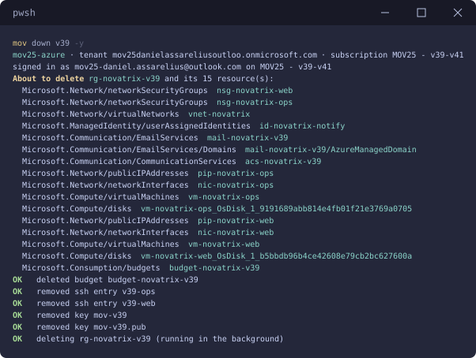

`mov down v39-cf` river på samma sätt, och dessutom appregistreringen och exakt de Cloudflare-objekt körningen skapade. Nästa `mov up` av någon av dem bygger samma kedja igen, med samma namn, för det är vad koden säger.
