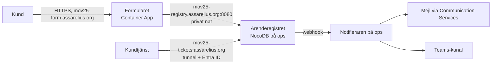
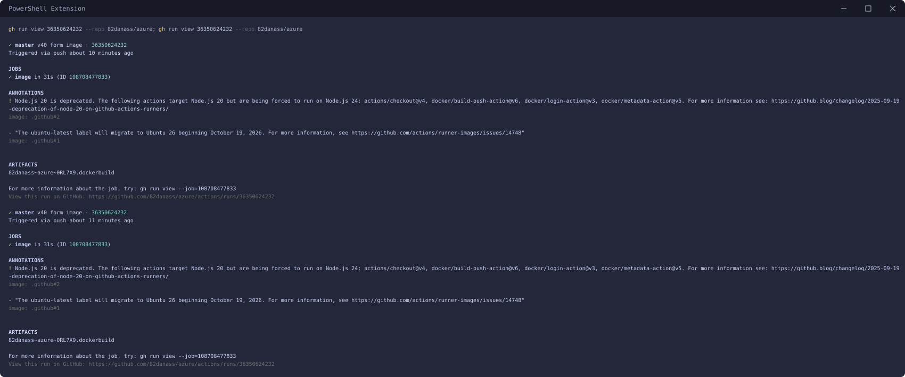
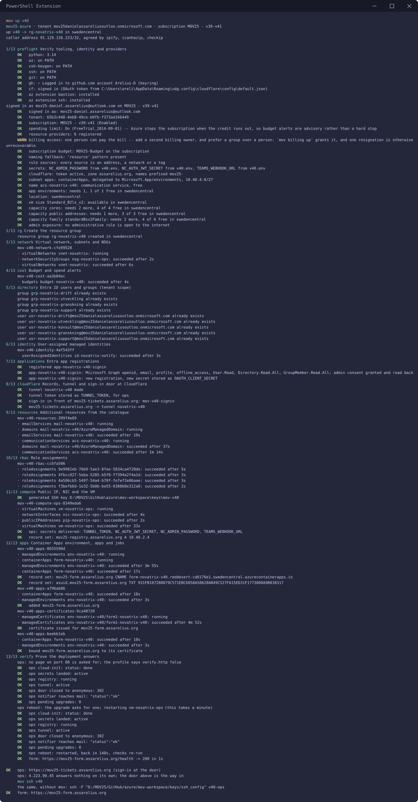
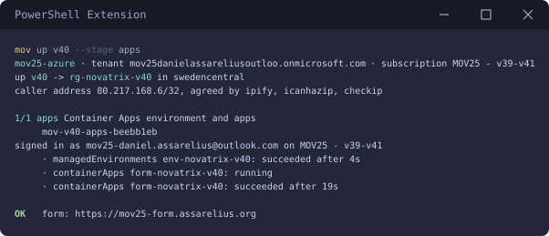
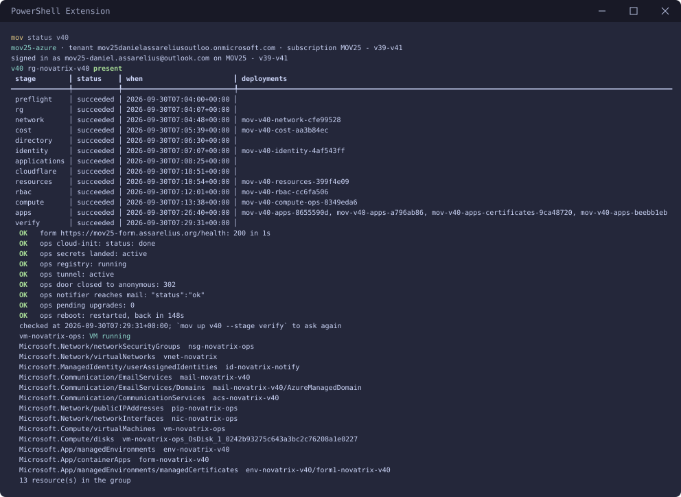
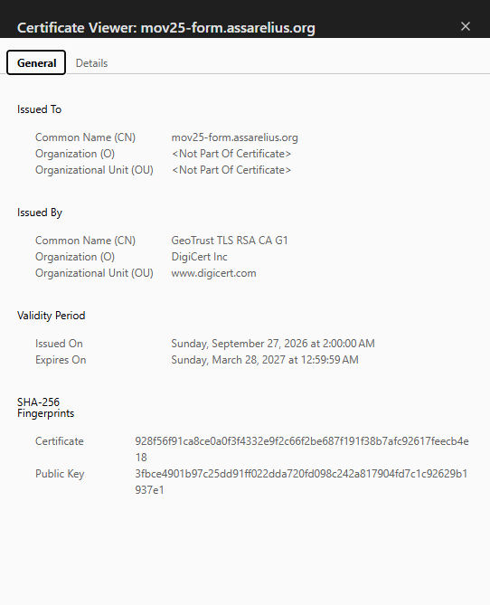
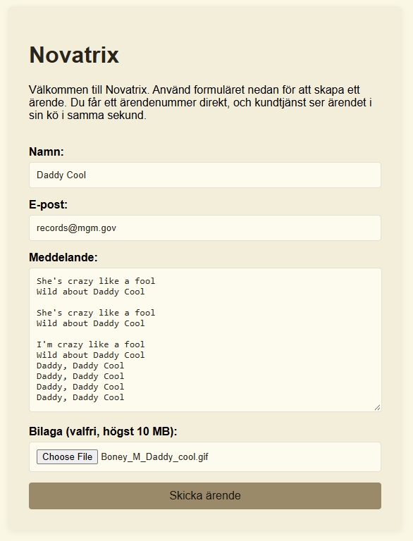
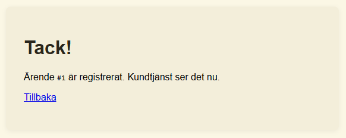
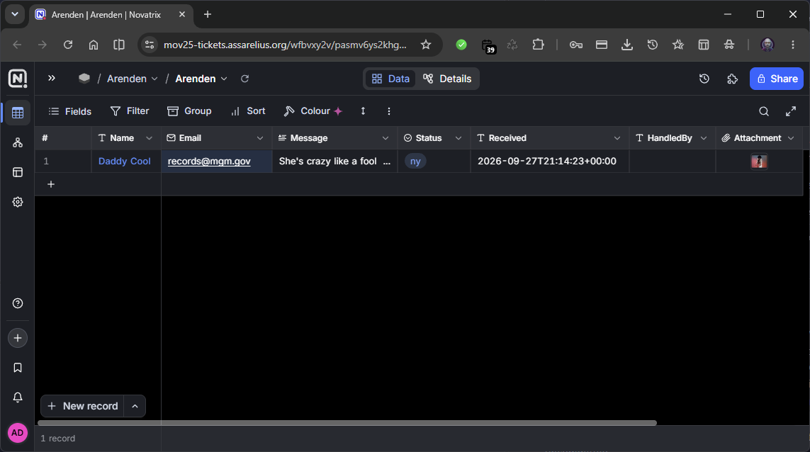
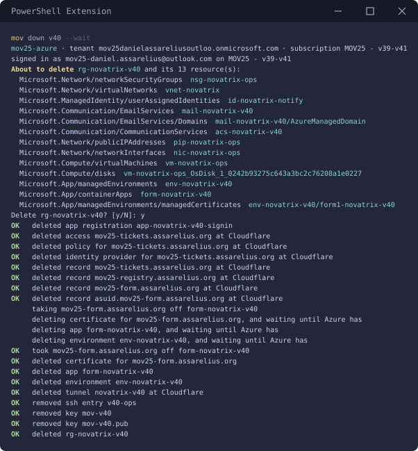

# v40 — Virtualiseringsnivåer

**Daniel Assarélius** · MOV25 · Microsoft Azure · Novatrix AB

Repo: [github.com/82danass/azure](https://github.com/82danass/azure) · Vecka: [v40](https://github.com/82danass/azure/tree/master/v40)

- [x] Skapa avsnitt för v40 och uppdatera README
- [x] Paketera och kör en del av kundtjänsten som en container på Azure: ärendeformuläret på Azure Container Apps, med imagen byggd av GitHub Actions
- [x] Beskriv och jämför VM, containers och serverless, och för- och nackdelar för just ärendemottagningen
- [x] Visa att den alternativa lösningen fungerar och dokumentera jämförelsen: formuläret svarar på sitt eget namn över HTTPS, och ett ärende med bilaga landar som en rad i ärenderegistret

## Vägvalet

Jag flyttar ärendeformuläret från en virtuell maskin till en container: webbsidan och tjänsten bakom `POST /arenden`, som i v39 körde på en egen maskin bakom nginx. Nu kör det på Azure Container Apps, startar när någon besöker sidan och går ner till noll repliker när ingen gör det. Varför en container och inte en Azure Function står i jämförelsen nedan.

Ärenderegistret, NocoDB, stannar på ops-maskinen. Det har tillstånd: databasen, en SQLite-fil, och bilagorna ligger på maskinens disk. Formuläret har inget mellan två anrop. Det som har tillstånd ligger kvar på en maskin, det som saknar tillstånd flyttar, och den skillnaden är också jämförelsens kärna.

Resten av kedjan är densamma som i v39-cf: kundtjänst når registret på `mov25-tickets.assarelius.org` genom en Cloudflare-tunnel bakom en inloggning med Entra ID, och ett nytt ärende blir ett mejl och ett kort i Teams. Web-maskinen finns inte längre.

## Nivåerna

De tre nivåerna skiljer sig i vad som virtualiseras, och därmed i hur mycket jag själv sköter och hur mycket Azure sköter.

**Virtuell maskin.** En hypervisor delar upp en fysisk server i flera virtuella datorer. Varje maskin får en virtuell processor, minne, disk och nätverkskort, och kör ett helt eget operativsystem med egen kärna. Det är hårdvaran som virtualiseras. Från operativsystemet och uppåt är allt mitt: patchar, omstarter, runtime, appen och hur stor maskinen ska vara. En ny maskin tar minuter, eftersom ett helt operativsystem ska starta, och den kostar per timme den finns, använd eller inte.

**Container.** En container virtualiserar operativsystemet i stället för hårdvaran. Den är en vanlig process på en värd, avskild från andra processer av värdens kärna: namespaces bestämmer vad den ser, cgroups hur mycket processor och minne den får. Alla containrar på värden delar samma kärna. Det appen behöver, runtime, bibliotek och koden, ligger i en image som byggs en gång och startar likadant överallt, och eftersom inget operativsystem ska starta tar en ny container sekunder. Container Apps kör containrarna åt mig på Kubernetes som Azure sköter: jag anger imagen, processor och minne och regler för hur många repliker som ska köra, och Azure startar, flyttar och skalar dem, också ner till noll. Imagen är fortfarande min. Dess grund, Debian i `python:3.12-slim`, får säkerhetsuppdateringar, och dem tar jag in genom att bygga om imagen.

**Serverless.** Här är också körmiljön Azures. Jag lämnar bara koden för en funktion, och plattformen kör den när en händelse kommer: ett HTTP-anrop, en ny fil, ett meddelande i en kö. Servrar, operativsystem och runtime syns inte. Instanser startas och stoppas efter hur många händelser som kommer, ner till noll, och det som debiteras är körningarna och minnet medan de pågår. Priset för det är en kallstart efter en tyst period, en tidsgräns för varje anrop, och att funktionen inte håller något mellan två anrop.

Nivåerna bygger på varandra: Container Apps och Functions kör i sin tur på virtuella maskiner som Azure äger. Skillnaden är inte om det finns en maskin, utan vem som sköter den.

| | VM | Container (Container Apps) | Serverless (Functions) |
| --- | --- | --- | --- |
| Det som virtualiseras | Hårdvaran | Operativsystemet | Körmiljön |
| Det jag ger Azure | En maskin att köra | En image: appen och allt den behöver | En funktion, koden för en händelse |
| Det jag själv sköter | Operativsystem, patchar, omstarter, runtime, appen, storlek | Imagen, och att bygga om den när grunden uppdateras | Koden |
| Start | Minuter: maskinen, cloud-init, tjänsterna | Sekunder: en replik startar | Per anrop; kallstart efter en tyst period |
| Skalning | En maskin i taget, som jag skapar | Repliker efter trafik, också ner till noll | Per anrop, automatiskt |
| Betalning | Per timme maskinen finns, använd eller inte | Per sekund en replik kör; inget vid noll | Per körning och minnet under körningen |
| Tillstånd | Egen disk | Inget i containern; det ligger någon annanstans | Inget; det ligger någon annanstans |

I Novatrix finns alla tre, eller finns beskrivna:

- **VM:** ops-maskinen, och formulärets maskin under v34–v39. NocoDB kör i Docker på ops, men för driften är det fortfarande en maskin: operativsystemet, patcharna och omstarterna är mina.
- **Container:** formuläret, som Container App.
- **Serverless:** inte byggd. Ärendemottagningen är skolexemplet: en kort händelse, sällan, utan tillstånd.

## Jämförelsen för ärendemottagningen

Ärendemottagningen är sidan med formuläret och tjänsten bakom `POST /arenden`. En kund fyller i formuläret, bifogar kanske en fil på upp till 10 MB, och tjänsten skriver en rad i registret. Den har inget tillstånd, används sällan och ojämnt, och måste nå registret på ops-maskinen över det privata nätet. Priserna nedan är Azures listpriser i Sweden Central i september 2026, räknat på 730 timmar i månaden.

**På en VM (v34–v39).**

- För: allt är mitt att styra. Maskinen svarar direkt, eftersom den aldrig sover, och nginx framför tjänsten tog emot en uppladdning i sin helhet innan tjänsten fick den.
- Emot: maskinen står dygnet runt, oavsett om något ärende kommer. En B2ls_v2 kostar 0,41 kronor i timmen, cirka 300 kronor i månaden. Operativsystemet ska patchas, och varje verifiering under v34–v39 väntade in cloud-init och den omstart uppgraderingen bad om. Certifikatet hämtades av ett skript på maskinen från Let's Encrypt. Maskinen tog två av prenumerationens fyra kärnor, och den skalar bara genom att jag gör den större eller skapar en till.

**Som container på Container Apps (v40).**

- För: ingen maskin att patcha och inga omstarter att vänta på. Namnet och certifikatet sköter Azure. En ny version är en ny image med en ny tagg, som blir en ny revision. Formuläret skalar på trafiken, från noll till två repliker i profilen, och kör samma kod som på maskinen. Vid noll repliker kostar det ingenting, och prenumerationen har en kostnadsfri volym varje månad: 180 000 vCPU-sekunder, 360 000 GiB-sekunder och 2 miljoner anrop. Med formulärets 0,25 vCPU och 0,5 GiB räcker den till 200 timmar med en aktiv replik, och därefter kostar en replik cirka 0,26 kronor i timmen.
- Emot: kallstarten. Första anropet efter en tyst period tog 12 sekunder, nästa 0,3 (se Verifiering). För en kund som skickar ett ärende är det en väntan, men ingen förlust: ärendet kommer fram. Ingen nginx står framför, så tjänsten tar emot uppladdningen själv, och dess arbetare får inte avbrytas medan en stor bilaga kommer in. Imagen ska byggas om när dess grund får säkerhetsuppdateringar. Och miljön i ett eget nät, som krävs för att nå registret privat, har en lastbalanserare och två publika adresser som Azure debiterar så länge miljön finns: cirka 175 kronor för lastbalanseraren och 35 kronor för varje adress, drygt 240 kronor i månaden. Det är nästan vad maskinen kostade.

**Som Container Instances.** Också en container, men en byggkloss snarare än en plattform. Container Instances kör en grupp containrar tills den stoppas. Skalning, lastbalansering och certifikat ingår inte: formuläret skulle behöva en egen omvänd proxy för HTTPS, och det skalar inte själv, varken upp eller ner till noll. Det är skälet till att formuläret kör på Container Apps.

**Som Function (serverless).**

- För: hanteraren för `POST /arenden` är precis en händelse, och en funktion per ärende är det serverless är till för. Den debiteras per körning, med en kostnadsfri volym, skalar per anrop, och det finns varken maskin, runtime eller image att sköta.
- Emot: Python kräver Linux, och för nya serverless-appar pekar Microsoft på planen Flex Consumption. Den äldre Consumption-planen kan inte ansluta till ett virtuellt nät, så vägen till registret förutsätter Flex Consumption med ett eget subnät. Sidan och stilmallen är ingen händelse: de blir en egen funktion eller läggs som statisk webbplats någon annanstans, så formuläret delas i två delar. Ett HTTP-anrop till en funktion får ta högst 230 sekunder innan det måste besvaras, och en stor bilaga över en långsam uppkoppling ska rymmas inom det. Kallstarten finns också här; instanser som alltid är igång tar bort den, men de debiteras utan kostnadsfri volym. Koden publiceras som ett paket i ett lagringskonto, som också ska finnas.

### Valet för Novatrix

Formuläret hör hemma på Container Apps.

- **Behov:** formuläret saknar tillstånd, trafiken är ojämn och oftast noll, och det är en liten webbtjänst som både visar sidan och tar emot ärendet. En container kör det i ett stycke, med samma kod som på maskinen. En funktion skulle dela det i två.
- **Drift:** det som tog tid på maskinen, patchar, omstarter, cloud-init och certifikat, försvinner. Kvar är att bygga om imagen när grunden uppdateras, och det gör GitHub Actions vid varje ändring.
- **Skalbarhet:** en kampanj eller ett driftstopp som ger hundra ärenden på en timme möts av fler repliker utan att jag gör något. På en maskin hade det varit en större maskin, eller en till och en lastbalanserare. Taket är två repliker i profilen, och det höjs med en siffra.
- **Kostnad:** formuläret självt ryms i den kostnadsfria volymen. Miljön i eget nät kostar drygt 240 kronor i månaden, mot maskinens 300. I den här uppställningen är vinsten alltså driften, inte pengarna. Pengarna kommer när miljön inte behöver ett eget nät; se Optimering.

Registret stannar på en maskin tills vidare, eftersom det har en databas och bilagor, och det som ska flytta är tillståndet, inte bara processen.

Var datat ligger väger tyngre än både kostnad och skalning. Kundernas ärenden, med namn, e-post och bilagor, lagras i registret i Sweden Central, formuläret kör i samma region, och mejltjänsten har `dataLocation: Europe`. För GDPR är det vad som räknas, och det är ett val som står i profilen, inte något som följer med plattformen.

### Optimering

- **Kallstarten:** en replik som minimum under kontorstid, och noll på natten, tar bort väntan när kunder faktiskt skriver.
- **Nätet:** NocoDB som en container i samma miljö, med databasen i Azure Database for PostgreSQL i stället för SQLite-filen och bilagorna på en Azure Files-share som monteras i containern. Då når formuläret registret inne i miljön, miljön behöver inget eget nät, och lastbalanseraren och adresserna försvinner. Ops-maskinen finns då bara kvar för notifieraren.
- **Notifieraren:** den körs när NocoDB skickar en webhook om ett nytt ärende, och är en händelse med samma form som en funktion. Den är den del av kundtjänsten där serverless passar bäst, och som funktion tar den bort ops-maskinen helt: då sköter jag inget operativsystem alls.
- **Leveransen:** nästa version rullas ut som en ny revision medan den gamla fortfarande svarar, och trafiken flyttas först när den nya svarar på `/health`.
- **Allt som kod:** imagen byggs från repot, profilen namnger exakt vilken image som körs, och miljön skapas och rivs med ett kommando.

## Kedjan



Nätet är `10.40.0.0/16` med två subnät:

- **ops**, `10.40.2.0/24`: maskinen med registret och notifieraren. Dess brandvägg släpper in port 8080 bara från Container Apps-subnätet, och ssh bara från adressen som kör deployen. Kundtjänst kommer in genom tunneln, som inte öppnar någon port.
- **apps**, `10.40.4.0/27`: delegerat till `Microsoft.App/environments`, där Container Apps-miljön lägger sin infrastruktur. `/27` är det minsta Azure tar emot för en miljö med workload profiles.

Formuläret når registret på ett namn, inte en adress. `mov25-registry.assarelius.org` är en DNS-post hos Cloudflare, bara DNS och utan proxy, som pekar på ops-maskinens privata adress. Posten skapas av deployen från adressen maskinen fick, så ingen skriver in en IP-adress. Namnet slås upp var som helst, men adressen det pekar på går bara att nå inifrån nätet.

Formuläret har sitt eget namn, `mov25-form.assarelius.org`, med ett certifikat som Azure utfärdar och förnyar. Azure kontrollerar namnet genom en CNAME till appens genererade adress och en TXT-post, `asuid`, med appens verifierings-id. Därför går CNAME-posten utan Cloudflares proxy: certifikatet valideras genom den. Let's Encrypt och certifikatskriptet från v39 behövs inte.

## Koden

| Fil | Vad den gör |
| --- | --- |
| [`form/form.py`](form/form.py) | Samma formulärtjänst som i v39. `POST /arenden` blir en rad i registret, `/health` räknar öppna ärenden, och tjänsten serverar nu själv sidan och stilmallen, som nginx gjorde på maskinen. |
| [`form/public/`](form/public) | Formuläret och dess stilmall, oförändrade från v39. |
| [`form/Dockerfile`](form/Dockerfile) | Imagen: Python, Flask och gunicorn, tjänsten och sidan. |
| [`form/requirements.txt`](form/requirements.txt) | Flask och gunicorn, med låsta versioner. |
| [`.github/workflows/v40-form.yml`](../.github/workflows/v40-form.yml) | Bygger imagen vid varje push som ändrar `v40/form/` och publicerar den på `ghcr.io`. |
| [`mov-workspace/profiles/v40.json`](../mov-workspace/profiles/v40.json) | Hela miljön: nätet, ops-maskinen, Container Apps-miljön och appen, DNS-posterna, tunneln, dörren och mejltjänsten. |
| [`scripts/bootstrap-v39-ops.sh`](../scripts/bootstrap-v39-ops.sh) | ops-maskinen, oförändrad från v39: NocoDB i Docker, notifieraren och tunneln. |

## Imagen

```dockerfile
FROM python:3.12-slim

ENV PYTHONDONTWRITEBYTECODE=1 PYTHONUNBUFFERED=1
WORKDIR /app

COPY requirements.txt .
RUN pip install --no-cache-dir -r requirements.txt

COPY form.py .
COPY public/ public/

RUN useradd --create-home --uid 10001 form
USER form
EXPOSE 8080
CMD ["gunicorn", "--bind", "0.0.0.0:8080", "--worker-class", "gthread", "--workers", "2", "--threads", "4", "form:app"]
```

Arbetarna är trådade. En bilaga på upp till 10 MB över en långsam uppkoppling tar över en minut att komma fram, och en tråd tar emot den medan arbetsprocessen fortsätter att rapportera till gunicorn. I v39 tog nginx emot hela uppladdningen innan tjänsten fick den; här finns ingen nginx framför, så tjänsten tar emot den själv.

GitHub Actions bygger imagen och publicerar den som `ghcr.io/82danass/novatrix-form`, märkt med commiten den byggdes från:

```yaml
      - id: meta
        uses: docker/metadata-action@v6
        with:
          images: ghcr.io/${{ github.repository_owner }}/novatrix-form
          tags: type=sha,prefix=sha-

      - uses: docker/build-push-action@v7
        with:
          context: v40/form
          push: true
          tags: ${{ steps.meta.outputs.tags }}
```

Profilen namnger taggen, `sha-5ea8ac3`, så en deploy kör exakt det bygget och inget annat. Paketet är publikt, så Azure hämtar imagen utan inloggning och inget containerregister i Azure behövs.

Bygget som gav `sha-5ea8ac3`, på 31 sekunder:



## Deploy från kod

Containern i profilen är Azures egen form för en Container App: imagen, resurserna, variablerna, en hemlighet och skalningen från noll till två repliker.

```json
"apps": {
  "environment": {
    "purpose": "env",
    "properties": {
      "workloadProfiles": [ { "name": "Consumption", "workloadProfileType": "Consumption" } ],
      "vnetConfiguration": { "infrastructureSubnetId": "@output:network.subnets.apps.id", "internal": false }
    }
  },
  "apps": [ {
    "purpose": "form",
    "domains": [ { "name": "@output:cloudflare.hosts.form", "certificate": "managed" } ],
    "verify": { "httpPath": "/health", "expectText": "\"status\":\"ok\"" },
    "properties": {
      "environmentId": "@resourceId:env",
      "workloadProfileName": "Consumption",
      "configuration": {
        "ingress": { "external": true, "targetPort": 8080 },
        "secrets": [ { "name": "nc-admin-password", "value": "@secret:NC_ADMIN_PASSWORD" } ]
      },
      "template": {
        "containers": [ {
          "name": "form",
          "image": "ghcr.io/82danass/novatrix-form:sha-5ea8ac3",
          "resources": { "cpu": 0.25, "memory": "0.5Gi" },
          "env": [
            { "name": "NOVATRIX_TICKETS_URL", "value": "http://mov25-registry.assarelius.org:8080" },
            { "name": "NC_ADMIN_EMAIL", "value": "admin@novatrix.se" },
            { "name": "NC_ADMIN_PASSWORD", "secretRef": "nc-admin-password" }
          ]
        } ],
        "scale": { "minReplicas": 0, "maxReplicas": 2 }
      }
    }
  } ]
}
```

DNS-posterna står i samma profil. Deras värden är vad deployen själv rapporterar: appens genererade adress, dess verifierings-id och ops-maskinens privata adress.

```json
"records": [
  { "name": "form", "type": "CNAME", "value": "@output:apps.apps.form.fqdn", "proxied": false },
  { "name": "asuid", "under": "form", "type": "TXT", "value": "@output:apps.apps.form.verificationId" },
  { "name": "registry", "type": "A", "value": "@output:compute.ops.privateIp", "proxied": false }
]
```

Lösenordet till registret står inte i profilen. `@secret:NC_ADMIN_PASSWORD` blir en hemlighet i Container Appen, satt från den lokala hemlighetsfilen när deployen körs, och finns varken i repot, i imagen eller i mallarna som sparas.

`mov up v40`



Steg 11 skapar ops-maskinen, och när den har en adress görs posten `mov25-registry.assarelius.org`. Steg 12 skapar Container Apps-miljön i sitt subnät, på knappt fyra minuter, och appen. När appen står görs formulärets CNAME och TXT-post, och sedan tar Azure namnet i tre steg: namnet läggs till på appen, certifikatet utfärdas, på knappt fem minuter, och namnet binds till certifikatet. Steg 13 verifierar: ops-maskinens kontroller före och efter den omstart uppgraderingen bad om, och sist formulärets `/health` på `https://mov25-form.assarelius.org`.

En ny version av formuläret är en ny tagg i profilen och ett steg:

`mov up v40 --stage apps`



Namnet och certifikatet var redan bundna och står i det sparade tillståndet, så appen fick den nya imagen i en enda deployment på 19 sekunder, utan att namnet togs bort eller certifikatet utfärdades igen.

`mov status v40`: alla tretton steg lyckade, formulärets `/health` som svarade `200`, ops-maskinens kontroller godkända, och de tretton resurserna i gruppen, bland dem Container Apps-miljön, appen och certifikatet.



## Verifiering

`https://mov25-form.assarelius.org/health` svarar `200` med `"status":"ok"` bara när formuläret har loggat in i registret och läst tabellen `Arenden`. Svaret visar alltså hela vägen: namnet och certifikatet hos Azure, containern, och det privata nätet till NocoDB på ops-maskinen.

Svaret tog 12 sekunder. Appen stod på noll repliker, så tiden är en kallstart: Azure startar en replik, gunicorn startar tjänsten, och tjänsten loggar in i registret innan den kan svara. Mätt direkt efter en tyst period och sedan igen:

```powershell
PS D:\> curl.exe -s -o NUL -w "%{http_code} %{time_total}s\n" https://mov25-form.assarelius.org/health
200 12.257134s
PS D:\> curl.exe -s -o NUL -w "%{http_code} %{time_total}s\n" https://mov25-form.assarelius.org/health
200 0.294753s
```

Första svaret efter tystnaden tar drygt 12 sekunder, nästa 0,3.

Certifikatet på `mov25-form.assarelius.org` är utfärdat av DigiCert (GeoTrust TLS RSA CA G1) till formulärets namn och gäller till 28 mars 2027. Azure förnyar det.



Ett ärende genom formuläret, med en bild som bilaga:





Ärendet i registret, genom dörren på `mov25-tickets.assarelius.org`: raden i tabellen `Arenden` med status `ny`, mottagningstiden och bilagan.



## Återskapa miljön

Från repot, utan portal. Hemligheterna och Cloudflare-token ligger inte i repot och sätts en gång:

```powershell
git clone https://github.com/82danass/azure.git
cd azure\mov-workspace
az login
mov subscription pin "MOV25 - v39-v41"
mov secrets set cloudflare CLOUDFLARE_API_TOKEN
mov secrets set v40 NC_ADMIN_PASSWORD
mov secrets set v40 NC_AUTH_JWT_SECRET
mov secrets set v40 TEAMS_WEBHOOK_URL
mov check v40
mov up v40
```

Imagen byggs av GitHub Actions när `v40/form/` ändras, och profilen namnger taggen som ska köras. `TUNNEL_TOKEN` och `OAUTH_CLIENT_SECRET` skapas under körningen.

## Rivning

`mov down v40 --wait`



`mov down v40` river budgeten, appregistreringen och Cloudflare-objekten: dörren och posterna. Sedan river den Container Apps-delen baklänges mot hur den byggdes: namnet tas bort från appen, certifikatet raderas, sedan appen och sist miljön, och varje steg väntar tills Azure är klart. En radering av resursgruppen ordnar inte det själv, för ett certifikat som är bundet till ett namn går inte att radera, och miljön går inte att radera så länge den har certifikatet. Miljön tog drygt 22 minuter att radera. Azure tar också bort sin egen resursgrupp för miljön, `ME_env-novatrix-v40_rg-novatrix-v40_swedencentral`, med lastbalanseraren och dess adress.

Därefter raderas resursgruppen med ops-maskinen, nätet, adressen och e-posttjänsten, på tre minuter. Tunneln raderas sist, när maskinen som höll den uppe är borta.
