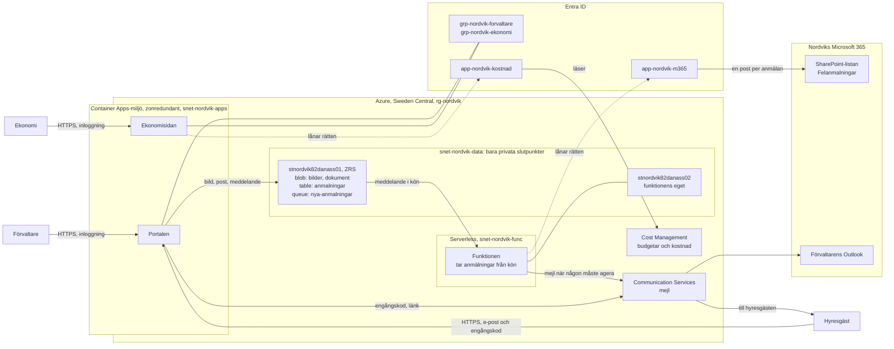
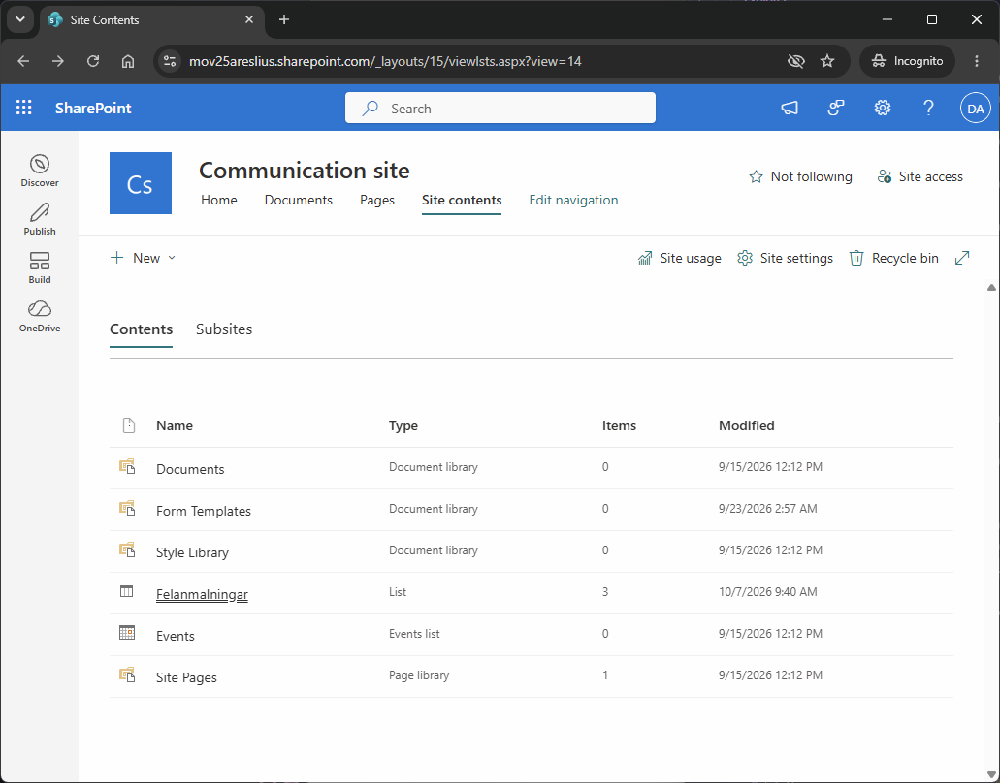
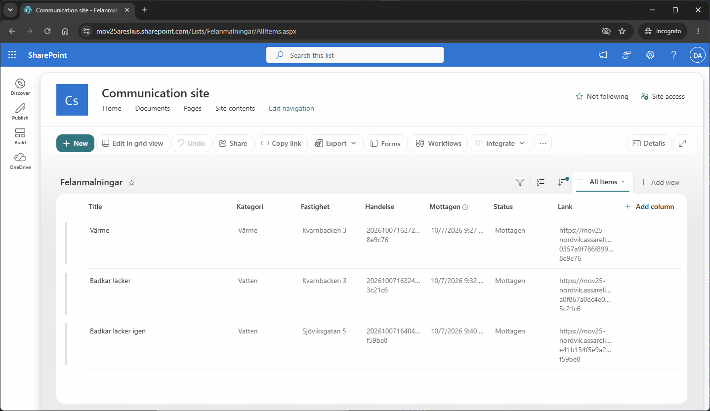
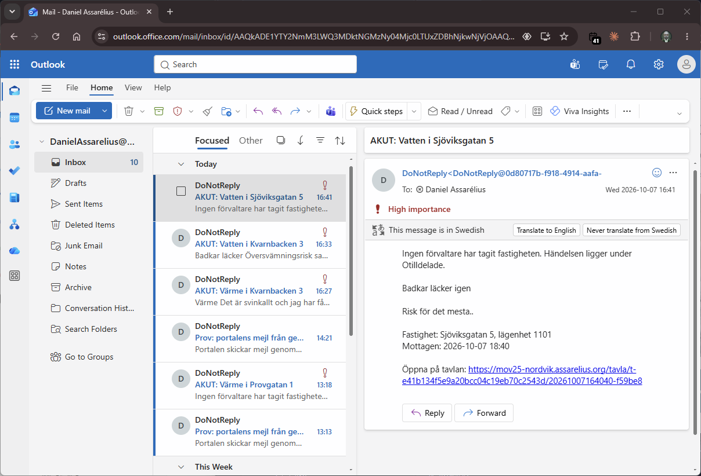
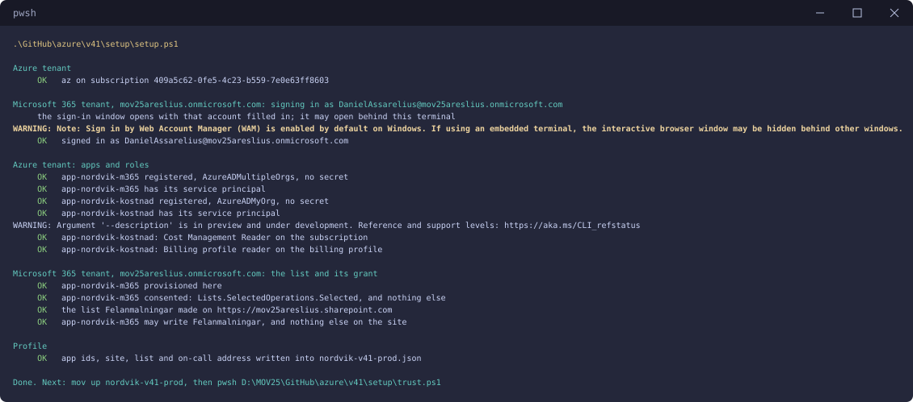
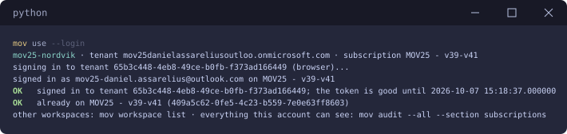
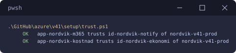
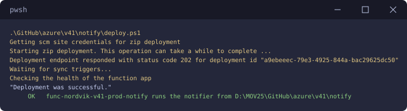
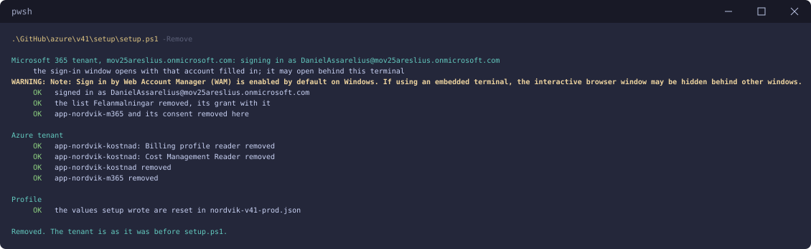

# v41 — Nordviks hyresgästportal

**Daniel Assarélius** · MOV25 · Microsoft Azure · Nordvik Fastigheter AB

Repo: [github.com/82danass/azure](https://github.com/82danass/azure) · Vecka: [v41](https://github.com/82danass/azure/tree/master/v41)

- [x] Skapa avsnitt för v41 och uppdatera README
- [x] Del A: redogör för tjänsterna inom compute, nätverk och storage, förklara virtualiseringsnivåerna och motivera nivån för portalen: container för portalen, serverless för funktionen som tar anmälningarna
- [x] Delmoment 1, Compute: värdmiljön och felanmälan med rubrik, beskrivning och bild: portalen och ekonomisidan på Azure Container Apps i en zonredundant miljö, funktionen på Flex Consumption
- [x] Delmoment 2, IAM: Nordviks roller enligt least privilege och en hanterad identitet mot lagringen: en grupp per roll bland personalen, hyresgästen utan konto med en engångskod, en hanterad identitet per uppgift
- [x] Delmoment 3, Nätverk och säkerhet: defense in depth med en publik portal och skyddad lagring: lagringen bara på privata slutpunkter bakom en nätverkssäkerhetsgrupp, nycklarna avstängda
- [x] Delmoment 4, Storage: säker lagring av bilder och dokument: blob, tabeller och kö i ett zonredundant konto utan publik adress, dokumenten till Cool efter 90 dagar
- [x] Delmoment 5, IaC: ARM-templates i GitHub, återskapbart från repot: allt i Azure från en profil med mov, tenantens del med setup.ps1
- [x] Delmoment 6, Automation och integration: en post i en lista och en notis till rätt förvaltare i Nordviks Microsoft 365: funktionen för in posten i SharePoint-listan genom Microsoft Graph och mejlar genom Communication Services
- [x] Delmoment 7, Dokumentation: hur lösningen planerats, byggts och återskapas: den här README:n

## Vägvalet

Tre saker styr varje val i lösningen, i den ordning en verksamhet väger dem, i någorlunda relation till hur uppgiften framställer behovet: vad den kostar, hur få människor som behöver röra ett ärende och hur få delar som behöver finnas. Den tredje hänger ihop med den första, eftersom varje del ska driftas, säkras och betalas.

En hyresgäst behöver inget konto. Hen fyller i felanmälan på portalen, beskriver felet, laddar upp en bild och anger sin egen e-postadress. En engångskod till adressen bekräftar att den är hens. När koden är inskriven sparar portalen bilden och uppgifterna i lagring som saknar adress på internet och lägger anmälan i en kö. Ett bekräftelsemejl ger hyresgästen en personlig länk där hen följer sina anmälningar. Där slutar portalens jobb. En funktion tar anmälan från kön och lägger den hos den förvaltare som tagit ansvar för fastigheten. Har ingen tagit fastigheten hamnar anmälan under Otilldelade, som alla förvaltare ser. Funktionen för också in en kopia av anmälan i en SharePoint-lista i Nordviks Microsoft 365 och skickar ett mejl när någon behöver agera. Förvaltaren arbetar på ett enda ställe: en tavla i portalen med sina fastigheter och de otilldelade. Där tar hen ansvar för fastigheter, bedömer hur bråttom det är och sätter status, som hyresgästen ser genom sin länk. Ekonomi ser anmälningarna och vad driften kostar.

Inget i kedjan bär en hemlighet som når Azure eller Microsoft 365. Personalen loggar in på portalen och ekonomisidan genom registreringar som litar på sidornas egna identiteter. Funktionen når Microsoft 365 genom en app som litar på funktionens identitet. Ingen VM finns, alltså finns inget operativsystem att patcha och inget skal att logga in i.

Allt i Azure byggs från profiler i repot med [mov](https://github.com/Arelius-D/mov), mitt eget verktyg som översätter en profil till ARM-templates och driftsätter dem i ordning. Den del som ARM inte kan beskriva, SharePoint-listan och behörigheterna i Microsoft 365, sätts upp en gång av ett skript i samma repo.

## Driftsättning av lösningen

Hela lösningen byggs upp och rivs med kommandon i terminalen från repots rot. Inget klickas någonstans, varken för att driftsätta eller för att konfigurera före eller efter. Allt följer av val som står i repot och inte av en förhoppning om att Microsoft inte har flyttat runt i sina grafiska gränssnitt.

**Upp**

```powershell
# 1. Nordviks tenant, en gång. Inloggning som global administratör i Microsoft 365.
.\v41\setup\setup.ps1

# 2. Miljön i Azure.
mov workspace use mov25-nordvik
mov up nordvik-v41-prod

# 3. Identiteterna får låna apparnas rättigheter.
.\v41\setup\trust.ps1

# 4. Funktionens kod.
.\v41\notify\deploy.ps1
```

**Ner**

```powershell
# 1. Förtroendet först, medan identiteterna finns att peka ut.
.\v41\setup\trust.ps1 -Remove

# 2. Allt i Azure.
mov down nordvik-v41-prod -y

# 3. Tenantens del, bara när alla miljöer är rivna.
.\v41\setup\setup.ps1 -Remove
```

Varför ordningen är just den står under [Återskapa miljön](#återskapa-miljön) och [Rivning](#rivning), med bilder från körningarna.

## Del A: tjänsterna och nivåerna

### Tjänsterna

#### Compute

- **Azure Container Apps** kör portalen och ekonomisidan som containrar. En Container Apps-miljö är det gemensamma nätet, lastbalanseringen och loggningen som apparna kör i. Apparna skalar på egna regler, ända ner till noll repliker.
- **Azure Functions på Flex Consumption** kör funktionen som tar anmälningar från kön. Den startar när ett meddelande kommer och kostar bara medan den arbetar.

#### Nätverk

- **Ett virtuellt nätverk**, `vnet-nordvik`, med tre subnät: ett för Container Apps-miljön, ett för funktionens utgående trafik och ett där lagringens privata adresser bor. Datasubnätet har en nätverkssäkerhetsgrupp som bara släpper in HTTPS från apparnas och funktionens subnät. Den gäller också för de privata slutpunkterna, som Azure annars låter gå förbi gruppen.
- **Privata slutpunkter** ger lagringskontot en adress inne i nätverket för blob, table och queue. Kontots publika adress är avstängd.
- **Privata DNS-zoner** gör att lagringens vanliga namn pekar på de privata adresserna inifrån nätverket.
- **Miljöns lastbalanserare och publika adress** tar emot HTTPS till portalen och ekonomisidan. Mina egna domännamn pekar dit via Cloudflare och Azure utfärdar certifikaten.

#### Storage

- **Ett lagringskonto**, `stnordvik82danass01`, med blob för bilder och dokument, tabeller som är lösningens databas och en kö mellan portalen och funktionen. Kontot är zonredundant (ZRS): tre kopior i tre zoner.
- **En livscykelregel** flyttar dokument till den svalare nivån Cool efter 90 dagar.
- **Funktionens eget lagringskonto**, `stnordvik82danass02`, för dess kod och dess interna bokföring, så att funktionens breda roll där aldrig når hyresgästernas data.

**Det som binder ihop dem:** Entra ID med grupper per roll och hanterade identiteter, Communication Services för mejl, Microsoft Graph mot Microsoft 365 och Cost Management för ekonomisidan.

### Nivåerna

De tre nivåerna skiljer sig i vad som virtualiseras och därmed i hur mycket som är mitt att sköta.

**Virtuell maskin.** Hårdvaran virtualiseras. En hypervisor delar en fysisk server i flera maskiner med var sin processor, minne, disk och nätverkskort. Varje maskin kör ett eget operativsystem. Allt från operativsystemet och uppåt är mitt: patchar, omstarter, runtime och appen. En maskin kostar per timme den finns, använd eller inte. Att tåla att en faller bort kräver två maskiner och en lastbalanserare framför dem.

**Container.** Operativsystemet virtualiseras. En container är en avskild process som delar kärnan med värden, med appen och allt den behöver i en image som startar likadant överallt. Den startar på sekunder. Container Apps kör containrarna åt mig: jag anger imagen och reglerna för hur många repliker som ska köra, Azure startar, flyttar och skalar dem.

**Serverless.** Körmiljön virtualiseras. Jag lämnar koden för en funktion och plattformen kör den när en händelse kommer, till exempel ett meddelande i en kö. Det som kostar är körningarna. Priset är en kallstart efter en tyst period och att funktionen inte håller något mellan två anrop.

| | VM | Container | Serverless |
| --- | --- | --- | --- |
| Det som virtualiseras | Hårdvaran | Operativsystemet | Körmiljön |
| Det jag sköter | Operativsystem, patchar, runtime, appen | Imagen | Koden |
| Start | Minuter | Sekunder | Per anrop, kallstart efter tystnad |
| Skalning | En maskin i taget | Repliker efter regler, ner till noll | Per händelse |
| Kostnad | Per timme maskinen finns | Per sekund en replik kör | Per körning |

### Valet för portalen: container

Nordviks siffror pekar på containern.

- **Lasten följer klockan.** 1 800 inloggningar på vardagar med toppar 07–09 och 17–20 och nästan ingenting 00–06. Portalen håller två repliker på vardagar 06–21 och noll på natten. En maskin hade kostat lika mycket klockan tre på natten som klockan åtta på morgonen, vilket är precis den kapacitet Nordvik inte vill betala för.
- **Tåla att en instans faller bort.** Två repliker i en zonredundant miljö hamnar i olika zoner. Med maskiner hade det krävt två VM:ar och en lastbalanserare, dygnet runt.
- **Upp mot 120 samtidiga.** En HTTP-regel lägger till repliker vid trafik upp till sex och tar bort dem igen.
- **Portalen är en webbapp med sidor och inloggning.** Den passar som en container. Som funktioner hade varje sida fått sin kallstart och inloggningen sitt eget sessionsproblem.

Funktionen som hanterar anmälningarna är det motsatta fallet: händelsestyrt arbete utan någon som väntar på svaret. Det är serverless när det passar som bäst, så där valde jag Functions. Vid en vattenläcka kommer 300 anmälningar på en timme. De väntar i kön och funktionen arbetar sig igenom dem, medan portalen fortsätter ta emot nya.

## Vad sker automatiskt och var behövs en människa

Systemet fördelar anmälningarna efter fastighet, till den förvaltare som tagit ansvar för den i portalen. En fastighet som ingen har tagit hamnar under Otilldelade, som alla förvaltare ser. En samordnare som fördelar för hand vore ett mänskligt steg som bara lägger till väntan. En människa behövs där det krävs omdöme och ingen annanstans.

| Steg | Automatiskt eller människa |
| --- | --- |
| Bekräfta hyresgästens e-postadress med en engångskod | automatiskt |
| Spara anmälan: bild och uppgifter | automatiskt |
| Fördela till fastighetens förvaltare eller till Otilldelade | automatiskt |
| Samla anmälningar om samma fel till en händelse | automatiskt |
| Posten i SharePoint-listan i Microsoft 365 | automatiskt |
| Notisen och akutmejlet för värme, vatten och lås | automatiskt |
| Bedöma den verkliga prioriteten: sänka den, höja den | människa: förvaltaren |
| Status och att felet blir åtgärdat | människa: förvaltaren |
| Ta ansvar för en fastighet, lämna den eller lämna över den | människa: förvaltaren, i portalen |
| Mejlet till jouren när förvaltaren höjer en anmälan till akut | människan beslutar, systemet mejlar |

Kategorin som hyresgästen väljer säger vad som är trasigt, inte hur bråttom det är. En katt som gjort sina behov i toaletten kan hamna under vatten men är inte akut. En konstig lukt från spisen dagen efter att en elektriker varit där kan hamna under övrigt och är akut. Värme, vatten och lås mejlar direkt eftersom inget bättre är känt i den stunden. Därefter avgör den som kan.

**Mejl bara där någon måste agera.** En vattenläcka i ett hus med hundra lägenheter blir hundra anmälningar om samma fel. Hundra mejl till samma förvaltare hjälper ingen.

| Det som händer | Mejl |
| --- | --- |
| Hyresgästen ber om en kod | en engångskod till hyresgästen, giltig i tio minuter |
| Anmälan är sparad | en bekräftelse till hyresgästen med länken till de egna anmälningarna |
| En ny händelse | en notis till fastighetens förvaltare, en eller två om dagen en vanlig dag |
| Fler anmälningar till en öppen händelse | inget; antalet ökar på tavlan |
| En ny händelse i en fastighet som ingen har tagit | inget; den ligger under Otilldelade på varje förvaltares tavla |
| En ny händelse inom värme, vatten eller lås | samma mejl direkt, märkt akut, till förvaltaren och till jouren; bara till jouren om ingen har tagit fastigheten |
| Förvaltaren höjer en anmälan till akut | ett mejl till jouren |
| Förvaltaren sänker, sätter status eller tar ett jobb | inget; det syns på tavlan |
| Förvaltaren tar en fastighet | inget; hen tog den själv |
| Förvaltaren lämnar över en fastighet med en öppen akut händelse | ett mejl till den som tar emot |

### Arbetsgången

**Hyresgästen**

1. Fyller i formuläret: vad som är trasigt, fastighet och lägenhet, en bild och sin e-postadress.
2. Får en engångskod, skriver in den och skickar anmälan.
3. Får en bekräftelse med en personlig länk och följer anmälans status där.

**Förvaltaren**

1. Loggar in och tar ansvar för sina fastigheter på tavlan, en gång. Öppna anmälningar i en fastighet hen tar flyttar till hens tavla utan mejl: hen tog dem själv.
2. Får en notis när en ny händelse kommer i en av hens fastigheter. Akuta kommer direkt, också till jouren.
3. Bedömer prioriteten, sätter status och ser till att felet åtgärdas. Statusen följer med till SharePoint-listan och till hyresgästens länk.
4. Kan lämna en fastighet eller lämna över den till en kollega. Får kollegan en fastighet med en öppen akut händelse mejlar systemet hen. Annars syns den bara på tavlan.

**När ingen har tagit fastigheten**

- Anmälan hamnar under Otilldelade, överst på varje förvaltares tavla.
- En vanlig händelse mejlar ingen. Den ligger synlig tills någon tar fastigheten.
- En akut händelse mejlas direkt till jouren, så att den når någon som är vaken.

**Ekonomi**

1. Loggar in på ekonomisidan och följer kostnaden uppifrån och ner.
2. Läser anmälningarna i portalen utan att kunna ändra något.

## Lösningen



## Delmoment 1: Compute

**Portalen** är en liten Flask-app i en container, byggd av GitHub Actions till `ghcr.io`, på `mov25-nordvik.assarelius.org`. Den har fyra vyer: formuläret med rubrik, beskrivning, kategori, fastighet, lägenhet, bild, e-postadress och engångskod; hyresgästens egna anmälningar med status, nådda genom den personliga länken; förvaltarnas tavla med deras egna fastigheter och de otilldelade; ekonomins läsvy. Förvaltaren lägger till fastigheter och tar ansvar för dem i portalen.

**Skalningen** följer Nordviks klocka med två regler i appen. En tidsregel ber om två repliker på vardagar 06–21, svensk tid. En trafikregel lägger till repliker vid samtidiga anrop, upp till sex. När ingen regel ber om något går portalen ner till noll. En anmälan klockan tre på natten kommer ändå fram: trafiken väcker portalen, efter en kallstart på omkring tolv sekunder, uppmätt i [v40](../v40/README.md).

**Miljön** är zonredundant. Det bestäms när miljön skapas, kostar inget extra och betyder att två repliker hamnar i olika zoner.

**Funktionen** kör på Flex Consumption i ett eget subnät, med ett eget lagringskonto. Den ligger i en zon. En zonredundant funktion kräver två instanser som betalas dygnet runt. Kön håller ändå varje anmälan tills funktionen är tillbaka.

**Ekonomisidan** är en andra container i samma miljö, på `mov25-ekonomi.assarelius.org`, byggd på samma sätt som portalen. Den går ner till noll mellan besöken.

## Delmoment 2: IAM

**Två grupper** i Entra ID, en per roll bland personalen:

| Grupp | Får |
| --- | --- |
| `grp-nordvik-forvaltare` | se alla anmälningar på tavlan, bedöma prioritet, sätta status och ta ansvar för fastigheter |
| `grp-nordvik-ekonomi` | läsa anmälningarna och vad driften kostar, ändra inget |

Rollen kommer från gruppen i inloggningen. Förvaltare och ekonomi är anställda och får sina konton av Nordviks IT. Det är rätt plats för konton som någon skapar i förväg.

**Hyresgästen har inget konto.** 5 500 hyresgäster ska inte vara 5 500 objekt i Nordviks katalog med lösenord att återställa. Identiteten är den e-postadress som hyresgästen bekräftar med en engångskod:

1. Hyresgästen fyller i formuläret med sin egen e-postadress och ber om en kod.
2. Portalen skickar en sexsiffrig kod via Communication Services. Koden gäller i tio minuter och tål fem felaktiga försök.
3. Hyresgästen skriver in koden och skickar anmälan. Portalen sparar den med den bekräftade adressen som nyckel.
4. Ett bekräftelsemejl ger en personlig länk till hyresgästens egna anmälningar. Länken är signerad och tidsbegränsad. En ny fås med en ny kod.

Hyresgästen ser och skapar sina egna anmälningar, inga andra: portalen läser bara den del av tabellen som bär den bekräftade adressen. Portalen begränsar hur många koder en adress och en avsändare kan begära, så att ingen kan använda formuläret för att mejla andra.

Ett alternativ är Entra External ID, där kunder registrerar sig med e-post och engångskod i en egen kundtenant. Det ger samma sak med ytterligare en tenant och dess användarflöden att sköta, så jag valde det enklare.

**En hanterad identitet per uppgift**, var och en med roller på exakt det den rör:

| Identitet | Roller |
| --- | --- |
| `id-nordvik-portal` | skriva i containern `bilder`, skriva och läsa i tabellerna `anmalningar` och `fastigheter`, skicka till kön `nya-anmalningar`, skicka engångskoder och länkar via Communication Services |
| `id-nordvik-notify` | läsa och ta meddelanden från kön, föra in händelser i tabellen, skicka mejl, driva funktionen på sitt eget konto |
| `id-nordvik-ekonomi` | läsa gruppens resurser och räkna anmälningar |

Ingen identitet har en roll på Nordviks lagringskonto som helhet. Kontonycklarna är avstängda, så det finns ingen nyckel att läcka.

**Ingen människa har en roll i Azure.** Hyresgästernas data nås bara genom portalen, efter roll. Med nycklarna avstängda kan inte ens prenumerationens ägare läsa en bild utan att först ge sig själv en dataroll. Det loggas.

**Rättigheter utanför miljön** ligger på två appar som skapas en gång: `app-nordvik-m365` får skriva i SharePoint-listan, `app-nordvik-kostnad` får läsa kostnaderna. Varje gång miljön byggs litar apparna på de nya identiteterna och när miljön rivs slutar de lita på dem. Annars hade varje ny miljö krävt nya medgivanden av en administratör i Microsoft 365.

## Delmoment 3: Nätverk och säkerhet

| Lager | Vad det stoppar |
| --- | --- |
| Identitet | Personalen loggar in i Entra ID med roll från grupp; hyresgästen bekräftar sin e-post med en engångskod; inga hemligheter som når Azure eller Microsoft 365 |
| Kant | Bara HTTPS med Azures certifikat; portalen och ekonomisidan är det enda som syns utifrån |
| Nätverk | `vnet-nordvik` med tre subnät; till datasubnätet och dess privata slutpunkter släpper nätverkssäkerhetsgruppen bara in HTTPS från apparna och funktionen |
| Lagring | Ingen publik adress alls: privata slutpunkter och privata DNS-zoner, nycklar avstängda, ingen anonym åtkomst, TLS 1.2 |
| Data | Kryptering i vila, mjuk radering och versioner för blob, bilder och dokument i var sin container |
| Applikation | Hyresgästens egen del av tabellen, rollkontroll per sida, engångskoder med kort giltighet och få försök, gränser för hur många koder som kan begäras, bildens typ och storlek kontrolleras |

En brandvägg framför en publik adress hade också hållit ute obehöriga, så som jag gjorde i [v37](../v37/README.md). Här finns ingen publik adress att stå framför. Det kostar några hundra kronor i månaden för de privata slutpunkterna, för personuppgifter i drift är det värt dem. Det gäller båda lagringskontona: funktionens eget innehåller inga personuppgifter, men en regel för all lagring är enklare att hålla och att granska.

## Delmoment 4: Storage

| Del | Innehåll |
| --- | --- |
| Containern `bilder` | anmälningarnas bilder, namngivna efter anmälans id |
| Containern `dokument` | kontrakt och besiktningsprotokoll, till Cool efter 90 dagar |
| Tabellen `anmalningar` | en rad per anmälan med hyresgästens bekräftade adress, hashad, som nyckel för sin del. Engångskoderna ligger där under sin korta giltighet. |
| Tabellen `fastigheter` | fastigheterna och vem som ansvarar för var och en, skötta av förvaltarna i portalen |
| Kön `nya-anmalningar` | anmälningar på väg från portalen till funktionen |

Dokumenten flyttas till Cool och inte till Archive. De läses sällan efter tre månader, men ett kontrakt ska fortfarande öppnas på sekunder när det behövs.

**Avgränsning:** kontrakt laddas inte upp genom portalen. Containern, livscykeln och åtkomsten finns på plats.

## Delmoment 5: IaC

Lösningen återskapas från repot i fyra delar:

- **Nordviks tenant, en gång:** [setup.ps1](setup/setup.ps1) skapar SharePoint-listan och de två apparna med sina rättigheter. ARM beskriver Azure, inte Microsoft 365, så den delen är kod i stället för klick.
- **Imagerna:** GitHub Actions bygger portalen och ekonomisidan vid varje push som ändrar `v41/portal` eller `v41/ekonomi`, med [v41-portal.yml](../.github/workflows/v41-portal.yml) och [v41-ekonomi.yml](../.github/workflows/v41-ekonomi.yml). Varje bygge hamnar på `ghcr.io` med två taggar: `sha-` följt av commitens hash samt `latest`, som profilen kör. Paketen är publika, så Container Apps hämtar dem utan inloggning mot registret.
- **Miljön, så ofta det behövs:** `mov up nordvik-v41-prod` bygger allt i Azure från [profilen](../mov-workspace-nordvik/profiles/nordvik-v41-prod.json) med [mov](https://github.com/Arelius-D/mov) och `mov down nordvik-v41-prod` river det.
- **Förtroendet och funktionens kod:** efter `mov up` låter [trust.ps1](setup/trust.ps1) apparna lita på miljöns nya identiteter och [deploy.ps1](notify/deploy.ps1) lägger funktionens kod i funktionsappen. Ordningen och skälen står under [Återskapa miljön](#återskapa-miljön).

**Test- eller demomiljön** är `nordvik-v41-prod` med ett annat namn: [nordvik-v41-test.json](../mov-workspace-nordvik/profiles/nordvik-v41-test.json) ärver allt och byter bara grupp och budget. Prenumerationen tillåter en Container Apps-miljö, så test och prod står aldrig samtidigt här.

**Taggar** på varje resurs: `foretag`, `miljo`, `avdelning`, `fastighet`, `kostnadsstalle`. Portalen och funktionen bär `avdelning: forvaltning`, ekonomisidan `avdelning: ekonomi`, det delade `gemensam`.

**En budget** på `rg-nordvik` på Nordviks riktvärde, 2 500 kronor i månaden, med larm.

## Delmoment 6: Automation och integration

Arbetet sker i Azure och resultatet hamnar i Nordviks Microsoft 365: en post i SharePoint-listan `Felanmalningar` och ett mejl till förvaltarens Outlook.

**SharePoint-listan är en kopia, inte databasen.** All data bor i Table storage i Nordviks privata lagringskonto: anmälningarna, fastigheterna och vem som ansvarar för dem. Där läser och skriver portalen. Därifrån hämtar tavlan, hyresgästens länk och ekonomisidan allt. Listan får en kopia i en riktning:

| Det som händer | I listan |
| --- | --- |
| En anmälan sparas | en ny post: rubrik, kategori, fastighet, händelse, mottagen tid, status och en länk till anmälan i portalen |
| Förvaltaren ändrar status | postens status uppdateras |
| Allt annat | inget; listan läser aldrig tillbaka något och ingen arbetar i den |

Bilden och hyresgästens e-postadress går aldrig till listan.

Listan finns för att uppgiften kräver en post i en lista i Nordviks Microsoft 365. I en lösning för riktig drift hade jag inte haft den. Nordvik kallar själv felanmälan affärskritisk. En SharePoint-lista är ett bra verktyg för listor som människor sköter för hand, men för affärskritisk data är den fel verktyg. En lista är ingen databas: den saknar transaktioner, SharePoint [begränsar hur många anrop som får göras](https://learn.microsoft.com/en-us/sharepoint/dev/general-development/how-to-avoid-getting-throttled-or-blocked-in-sharepoint-online) och [listvyer stoppas över 5 000 poster](https://learn.microsoft.com/en-us/troubleshoot/sharepoint/lists-and-libraries/items-exceeds-list-view-threshold) om kolumnerna inte är indexerade. Listan rymmer [upp till 30 miljoner poster](https://learn.microsoft.com/en-us/office365/servicedescriptions/sharepoint-online-service-description/sharepoint-online-limits), men Nordviks 70 anmälningar om dagen passerar vygränsen på ungefär tio veckor. Listan kostar dessutom pengar, eftersom den förutsätter Microsoft 365-licenser. Nordvik har dem redan, men som plats för data vore de ett dyrt val. Därför ligger datan i Table storage och listan får bara en kopia som inget i lösningen är beroende av. Är SharePoint nere märks det inte i portalen. Funktionen försöker igen senare.

**Funktionen gör integrationen.** Den har redan varje anmälan och dess anrop till Microsoft Graph är kod i repot, byggd tillsammans med resten.

| Väg | Varför inte |
| --- | --- |
| Power Automate | Byggs genom klick i Microsoft 365. Ett exporterat flöde är en ögonblicksbild och inte en driftsättning. Dess adress är en hemlighet i sig. |
| Logic Apps | Själva flödet är ARM, men varje koppling måste godkännas av en person som loggar in, igen efter varje rivning. |

**Utan hemlighet över gränsen.** `app-nordvik-m365` finns i Azures tenant, är godkänd en gång i Nordviks Microsoft 365 och får skriva i en enda lista, inte ens i resten av webbplatsen. Funktionen hämtar en token med sin identitet och växlar den mot en token för appen.

**Mejlen** går genom Communication Services, byggt av mov som allt annat i Azure. De landar i förvaltarens Outlook.

**Händelsekedjan:** portalen → blob, tabell och kö → funktionen → Entra ID → Microsoft Graph → SharePoint-listan. Mejlen går funktionen → Communication Services → Outlook.

**Avgränsning:** inga fastighetsskötare eller entreprenörer i systemet. Uppgiftens roller är hyresgäster, förvaltare och ekonomi. Ingen Teams-notis: en app kan inte skriva i Teams på egen hand utan handbyggda delar. Outlook räcker.

## Ekonomins insyn

Ekonomi ska kunna följa kostnaden per fastighet och avdelning. Ekonomisidan visar den uppifrån och ner, bara läsande:

1. Faktureringsprofilen: kostnad, återstående kredit, fakturor.
2. Prenumerationen: budget, förbrukning, prognos och larm som gått.
3. Resursgrupperna: budget mot 2 500 kronor och larm.
4. Kostnaden dag för dag och månadens prognos.
5. Resurserna med sina taggar och sin kostnad.
6. Per avdelning från taggen `avdelning`. Per fastighet genom att den gemensamma kostnaden delas efter fastighetens andel av anmälningarna, eftersom taggar ensamma inte kan dela en gemensam miljö.

## Kostnad

Riktvärdet är 2 500 kronor i månaden. Azures listpriser för Sweden Central:

| Del | Per månad |
| --- | --- |
| Portalen: två repliker på kontorstid | omkring 100 kr |
| Ekonomisidan: noll repliker mellan besöken | omkring 0 kr |
| Miljöns lastbalanserare och två publika adresser | omkring 255 kr |
| Privata slutpunkter och DNS-zoner | omkring 305–455 kr |
| Funktionen, inom sin fria mängd | omkring 0 kr |
| Lagring, ZRS, omkring 50 GB | under 20 kr |
| Mejl, omkring 5 000 i månaden med koder och bekräftelser | omkring 15 kr |
| **Totalt** | **omkring 700–850 kr**, ungefär en tredjedel av riktvärdet |

Det mesta är nätet som håller lagringen borta från internet och portalen nåbar. Med allt på noll repliker kostar miljön omkring 560–710 kronor.

## Verifiering

<!-- Efter bygget: en bild per delmoment. -->

### Delmoment 6: posten i SharePoint-listan och notisen i Outlook

Listan `Felanmalningar` ligger på Nordviks rotwebbplats, https://mov25areslius.sharepoint.com, under Site contents. Funktionen för in en post per anmälan.





Notiserna landar i Outlook. I exemplet har förvaltarna och jouren samma brevlåda, `DanielAssarelius@mov25areslius.onmicrosoft.com`. Vatten och Värme i Kvarnbacken 3 går till Karin Ek som har tagit fastigheten och till jouren. Vatten i Sjöviksgatan 5 går bara till jouren eftersom ingen har tagit fastigheten.



## Återskapa miljön

Lösningen byggs i fyra steg med kommandona under [Driftsättning av lösningen](#driftsättning-av-lösningen). Ordningen bestäms av vad varje steg behöver från det förra.

| Steg | Vad det gör | Varför just där |
| --- | --- | --- |
| 1. [setup.ps1](setup/setup.ps1) | Skapar `app-nordvik-m365` och `app-nordvik-kostnad`, SharePoint-listan och apparnas rättigheter. Skriver apparnas id, listans id och jourens adress i profilen. | Profilen behöver de id:na innan miljön byggs. Det sker en gång per företag, som att skapa prenumerationen. |
| 2. `mov up` | Bygger allt i Azure från [profilen](../mov-workspace-nordvik/profiles/nordvik-v41-prod.json), i mov:s ordning: nätverk, identiteter, lagring, privata slutpunkter, funktionen, roller och sist apparna. | Portalens och ekonomisidans images ska redan finnas på `ghcr.io`. GitHub Actions bygger dem vid varje push till `v41/portal` och `v41/ekonomi`. |
| 3. [trust.ps1](setup/trust.ps1) | Låter de två apparna lita på funktionens och ekonomisidans identiteter. | Identiteterna finns först efter `mov up` och varje `up` gör dem nya, så förtroendet kan ges först nu. |
| 4. [deploy.ps1](notify/deploy.ps1) | Lägger funktionens kod i funktionsappen och låter Azure bygga Python-paketen. | Funktionsappen finns först efter `mov up`. |



Kräver Entra en ny inloggning med MFA, som morgonen efter en kväll med mov, loggar `mov use --login` in i Nordviks Azure-tenant innan steg 1.








En ny miljö har inga fastigheter. För en demo lägger `.\v41\setup\seed.ps1` in fastigheterna i [exempel.json](setup/exempel.json): två för varje förvaltare och en som ingen har tagit. Skriptet skriver genom portalens egen kod som portalens identitet, i ett kortlivat jobb i miljön som tas bort efteråt.

En test- eller demomiljö är samma fyra steg med `nordvik-v41-test`, utan steg 1: tenanten är redan uppsatt.

Steg 1 och 3 är skript och inte ARM. Uppgiften kräver att resultatet hamnar i Microsoft 365 och ARM beskriver bara Azure, så en lösning som hela vägen är IaC går inte att bygga mot den beställningen. Det är beställningen som styr hit, inte tekniken. Uppgiften ser ut att vara skriven med en AI-modell: den låser lösningen till bestämda moduler i stället för att beskriva Nordviks behov och lämna valet av teknik åt den som bygger.

## Rivning

Kommandona står under [Driftsättning av lösningen](#driftsättning-av-lösningen).

Förtroendet tas bort först, medan identiteterna fortfarande finns att peka ut. `mov down` tar sedan resursgruppen med allt i den, budgeten, app-registreringarna för inloggningen och posterna hos Cloudflare. Det som `setup.ps1` gjorde ligger kvar, eftersom det är tenantens och inte miljöns.

Ska även tenanten tillbaka till noll körs `.\v41\setup\setup.ps1 -Remove` när alla miljöer är rivna. Den tar bort listan, båda apparna med deras rättigheter och nollställer värdena den skrev i profilen. Nästa `setup.ps1` bygger då allt från början.


